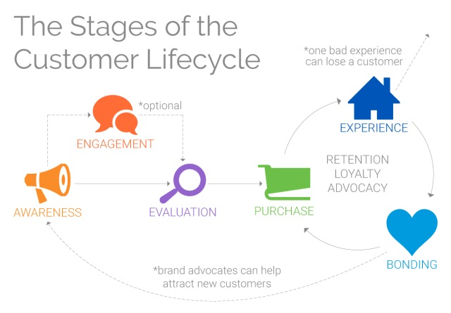
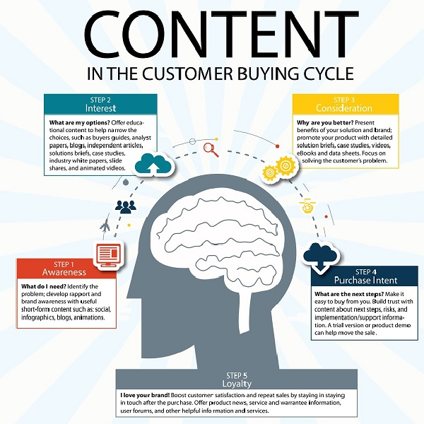

#   **Building User Lifecycle**

##  **What is User Lifecycle**

The user lifecycle is a term that describes the different steps a customer goes through when they are considering, buying, using, and remaining loyal to a particular product or service. 

In simple words, the customer lifecycle describes the various stages a consumer goes through **before, during and after** they complete a transaction.

##  **Lifecycle Stages**

A customer journey of fulfilling his/her needs/wants goes through a cyclic pattern of stages. These stages are known as the Lifecycle stages. Primarily, there are 5 stages of the User Lifecycle. We will discuss these stages in a detailed manner below:

### **Awareness**

**Awareness** is the first phase of the User lifecycle. This phase is considered to be the most important as this is the point where a consumer becomes aware of any services offered. Typically, all consumers start at this phase as they may learn about your services before engaging with you. This is when the consumer first becomes aware of the existence of your brand, product, or service.

**Awareness content** or top-of-funnel content attracts new audiences to your brand/services and helps prospects find answers to the questions they ask when they realize they have a need. Awareness content typically includes:

-   Blog posts
-   Infographics
-   Videos
-   Buying guides
-   Checklists
-   Social media posts
-   Interactive content

### **Engagement**

Once the consumer is aware of you, they’ll start seeking out your marketing content by following you on social media, signing up for your emails, etc.

In addition, they’ll start paying attention to what others are saying about you and how you respond to service requests and complaints. Brands that publicly engage and provide customer service through social media have an advantage at this stage.

**Engagement content** keeps audiences interested in your brand so that when they are ready to buy, they choose your company. Engagement content typically includes:

-   Email newsletters
-   Blog posts
-   nfographics
-   Videos
-   Social media posts
-   Interactive content

### **Evaluation**

In the evaluation stage, the consumer has discovered your business and is now collecting information to weigh the pros and cons of your offerings. Sometimes, this assessment is against your competition.

Other times, the consumer is contemplating how well your solutions fit their needs whether that be their budget, the outcomes they’re looking for by using your offerings, or other factors like ease of use.

It’s at this stage that a consumer might enter your sales funnel as a prospect or lead.

**Evaluation content** or middle-of-funnel marketing content helps inform customers as they decide if your brand, products, and services are a fit for what they need. Evaluation content typically includes:

* Landing pages
* Marketing case studies
* Product and service lists
* Data sheets
* Reviews and testimonials
* Webinars
* E-books and white papers

### **Purchase**

Here, we arrive at the point where a prospect takes the final decision and becomes a customer. They’ve evaluated your offerings and decided to buy from you.

But just because a customer reaches this stage does not mean the purchase is guaranteed. Tt’s possible for a customer to abandon their selection in your website’s digital shopping cart.

Or if your website doesn’t clearly state how to make a purchase, or that purchase process involves too many steps, the customer’s likelihood to give up increases.

**Purchase content** or bottom-of-funnel content is what customers interact with when they are ready to buy. This content targets buyer keywords and helps customers feel confident in making their purchase. Purchase content typically includes:

* Sales and landing pages
* Free trial sign-up pages
* Reviews
* Live demos
* Free consultations
* FAQs
* Live chats

### **Post-Purchase/Loyalty**

Now is when consumers start to form their lasting opinion about your services and your brand. On top of the obvious—delivering a quality product—you can ensure success at this stage by providing exceptional service and support. Every interaction is an opportunity to prove that you’re interested in building a relationship with your customers.

This phase is all about deepening the relationship with the customer after the purchase so that they are more likely to buy from you again.

**Post-purchase content** supports customers after their purchase and also re-engages and remarkets to them to bring them back into the purchase funnel. Post-purchase content supports user lifecycle marketing and typically includes:

* User guides
* Customer portals
* Email newsletters
* Coupons
* Surveys
* Social media posts

>:computer: [Learn more about User lifecycle here](https://www.fool.com/the-blueprint/customer-life-cycle/)

