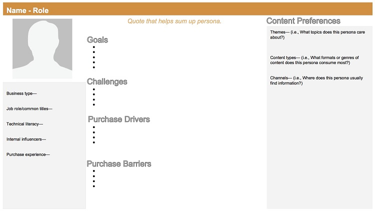
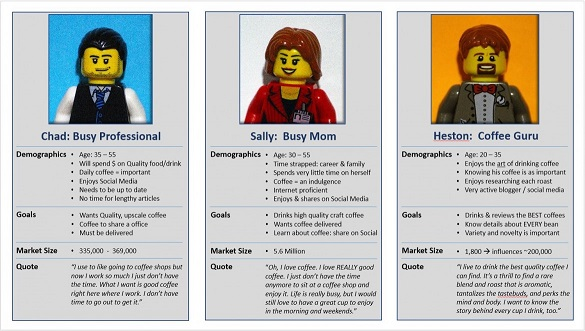
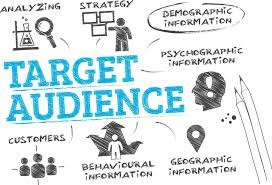
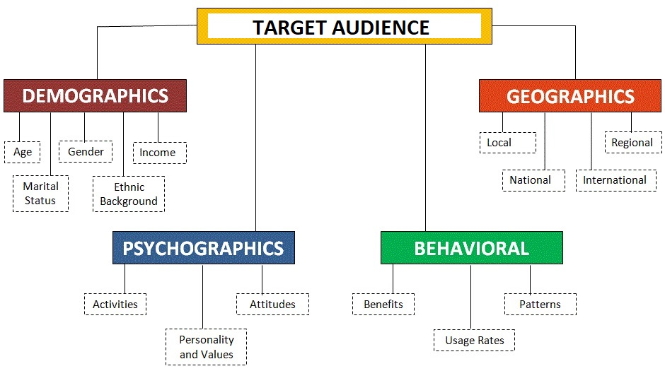
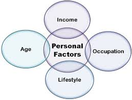
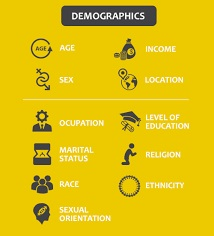
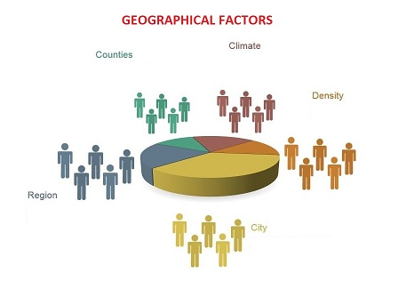
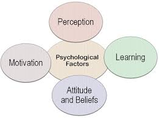
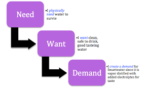

#   **Building User Personas**

**_"Personas and content mapping go hand in hand. You can’t create a useful and accurate content map without developing an in-depth buyer persona first."_**

##  **What is a User Persona**

-   A user persona is a semi-fictional character created to represent different customer types that use a company’s products or services. They are semi-fictional, in that they are not a specific individual, but their characteristics should be gathered from observation of real-world users.
-   A user persona is a detailed description of your ideal audience. It helps you get to know your customers and understand what they know, want, and need.
-   User personas are written as if the individual were real, but at the same time, they reflect common attributes across a cohort of people.
-   A well-researched, analytical and data-driven user persona is hugely beneficial to a company's product development, sales strategies and marketing campaigns. 
-   The function of user personas is to ensure that company initiatives (such as marketing or product development), are done with the user very firmly in mind.
-   Persona is simply a representation of your most common target audience. It’ll help you standardize needs and get solutions faster.

### **Benefits of building User Personas**

Below are a few benefits of building/creating User Personas:

-   It helps you to understand your user's needs, experiences, behaviours and goals.
-   It can help you to recognise that different people have different needs and expectations.
-   It can also help you to identify with the user your are designing for.
-   It makes the design task at hand less complex.
-   It guides the ideation process.
-   Personas can help to achieve the goal of creating a good user experience for the target audience/user group.

##  **Steps in Building User Personas**

A user persona compiles traits to create a representation of the ideal target audience/user. The building exercise helps you to visualize your ideal user and the process they go through on their way to becoming your customer. Let's look at the steps in building the User Persona:

1.  **Determine Method of Research** : The first step is to collect information about your target audience.This is where the [Data Collection](Data-Collection.md) methods come into consideration.
2.  **Identify Patterns** : Once you gather some data to analyze, it’s time to identify trends. It’s time to take a closer look at tagged data to see if overlap emerge naturally.
3.  **Create a Persona** : Once you’re done with collecting data and segmentation, it is finally time to start creating a persona. Inside this section, you should include:

    -   Details about the user’s education, lifestyle, interests, values, goals, needs, limitations, desires, attitudes, and patterns of behaviour.
    -   Add a few fictional personal details to make the persona a realistic character.
    -   Give each of your personas a name.
    -   Create 1–2-pages of descriptions for each persona.

4.  **Add End Goal** : The end goal is the motivating factor that inspires action, and answers the question: "what do users want or need to accomplish by using your product?" End goals are the main driving forces of your users and determine what the persona wants or needs to fulfill.
5.  **Add a Scenario** : A scenario is a “day-in-the-life” narrative that describes how a persona would interact with your product in a particular context to achieve his or her end goal(s). The scenario usually defines when, where, and how the narrative takes place. They are typically written from the perspective of the persona and describe use cases that may happen in the future.

Below is a sample User persona template:

Below are some examples of how different User Persona look like:

##  **Who is Target Audience**

Target audience refers to the specific group of consumers most likely to want your product or service, and therefore, the group of people who should see your ad campaigns/websites/services. Businesses use what they know about their target audience to create user personas. 

**Reasons to Define Target Audience**

Below are reasons, explaining the need to define Target audience:

1.  To ensure you're creating the right content, for the right people.
2.  To better understand how to create content that connects benefits to consumer needs.
3.  Increase conversions (thanks to 1 & 2)

Below factors play an important role in defining a target audience:

### **Personal Factors**

Personal factors can affect the consumer behavior. Some of the important personal factors that influence the buying behavior are: lifestyle, economic situation, occupation, age, personality and self concept.

### **Demographic Factors**

The below factors constitute the demographic profile of the target audience:

-   Age
-   Gender
-   Location
-   Hobbies
-   Income
-   Education Level
-   Profession
-   Marital status
-   Who they trust
-   What they read/watch

### **Geographic Factors**

Each geographic region represents specific culture and differs in terms of needs, preference, habits, usage rates, and uses of products/services. Clothing, residence, food, vehicle, etc., are determined by regional climate and culture. Customer preferences change based on geographic location. The following are some examples of geographic factors:

-   Region : by continent, country, state, or even neighbourhood.
-   Size of metropolitan area : segmented according to size of population.
-   Population density : often classified as urban, suburban, rural.
-   Climate : according to weather patterns common to certain geographic regions.

### **Psycological Factors**

There are four important psychological factors affecting the consumer buying behavior. These are: 

-   perception 
-   motivation
-   learning
-   beliefs and attitudes

### **Interests/Behavioral Factors**

The technique involves gathering data from a variety of sources about the potential customer’s online browsing and shopping behaviors.

This information helps create websites that are relevant to that specific user’s habits and interests, which the publisher can then display in that visitor’s web browser. These factors include:

-   Frequently visited pages
-   Webpage viewing times
-   Clicked Ads and links
-   Personal web searches
-   Webpage Element interactions
-   Transaction Progress
-   Purchase Histories
-   Time gaps between visits

### **Technological Factors**

With technological advances happening everyday, the customer is also changing. It is important to understand how the technology is influencing customer behaviour, thinking and experiences in order to grow regardless of all these factors. Below are some of the factors that need to be considered:

1.  **Decreased customer attention** : Nowadays, there is way too much content for people to consume which in turn is causing "content overload" in everyone's lives. This results in a decreased attention span of the target audience.  
2.  **Need for personalisation** : Technology has made it so easy and simple to create an online pressence for any business, which in turn again overloads the customer with irrelevant content. To provide a good customer experience, it is important to identify target audience and then personalise content and services accordingly.
3.  **The ease of access to info** : A few years ago, customers made buying decisions based on news, advertisements, past experience or referrals from other people. 

    However, technology has changed this. As per studies, 61% of customers use search engines to aid them in product research before they can make a buying decision. Hence, it is very important to show extremely relevant info about your services and products and make improvements based on reviews and ratings from past customers.

4.  **Brand trust and likability** : Technological advances has made the customer smart enough to make decisions based on their research and then trust a brand. To influence customer behaviour for the benefit of business, it is advised to to improve your online presence and reputation. Trustworthiness can be improved by including reviews, ratings and testimonials by past customers.
5.  **Customer expectations have gone up** : Technological advances have provided too many choices for the customer which in turn has increased their expectations. But, too many choices can confuse the customer and prevent them from taking a proper decision about a product/service. So, it is important to provide the customer with products/services which meet the customer expectations.

##  **What are the Needs/Wants/Desires of the Target Audience**

**_The needs, wants and demands of the customers/target audience vary greatly. They vary by target market, cultural and social norms and even market conditions. The important part is to know what they are, what your customers are willing and able to pay for and offer them what makes the most sense for that particular situation. It often comes down to effective listening and then matching your products and services to what your customer truly asking for._**

A **customer need** is a consumer’s desire for a product’s or service’s specific benefit, whether that be functional or emotional. The emotional benefit tends to be a stronger driver for consumers, as functional benefits can be easily copied by competitors. 

In short, needs are things that satisfy the basic requirement. In order for a business to be successful, it is key to identify and fulfil **customers’ needs.** There are four main customer needs that an entrepreneur or small business must consider. These are:

1.  **Price** : Price is how much a business charges for its product or service. Customers want a fair price when purchasing a product or service. Usually, low prices will draw in many customers, although people ultimately want value for money.

2.  **Quality** : Quality relates to the standard of the product or service being offered. Customers always expect some level of quality, no matter how much they pay for a product or service.

3.  **Choice** : Choice is very important – many businesses have a range of products and/or services available to suit different groups of customers. Customers have different needs and desires when buying items. They might want different styles or sizes, or even completely different products altogether. For example, a clothing business may need to stock a range of styles and sizes.

4.  **Convenience** : Convenience relates to something being easier, quicker or generally less hassle for customers. And for this the customers/consumers are often willing to pay more.

>:computer: [Read more about customer needs here](https://blog.hubspot.com/service/customer-needs)

A **consumer want** is the desire for products or services that are not necessary, but which consumers wish for. **Wants** are requests directed to specific types of items.

A **consumer demands** are wants for specific products that are backed up by an ability and willingness to buy them.

An example of needs/wants/desire can be seen below:

##  **Problems faced by Target Audience**