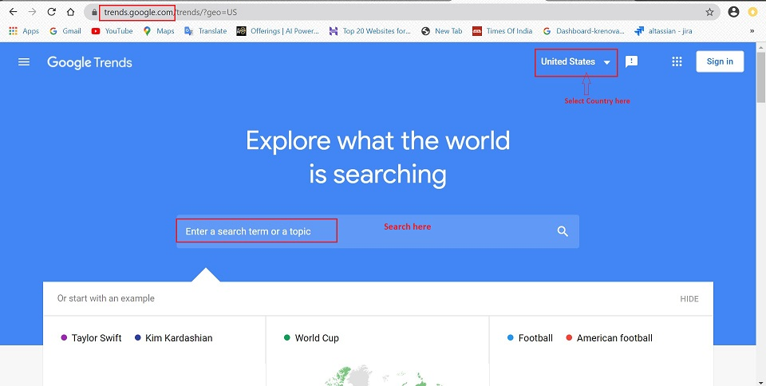
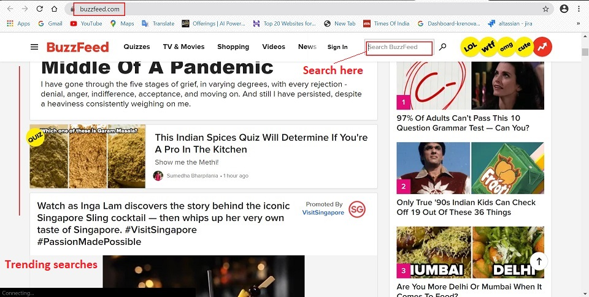
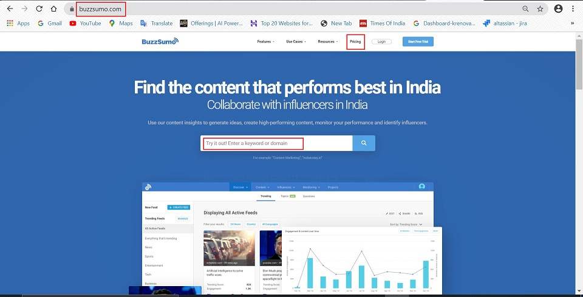
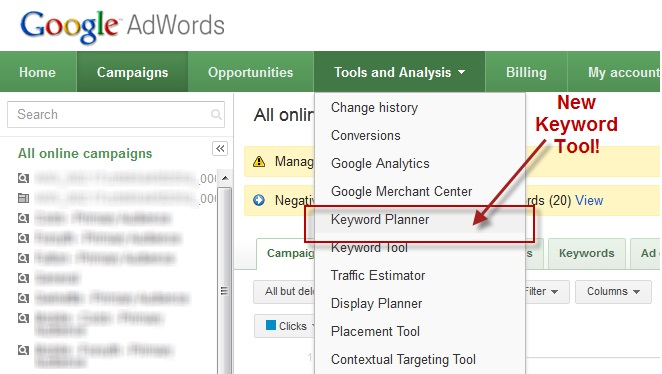
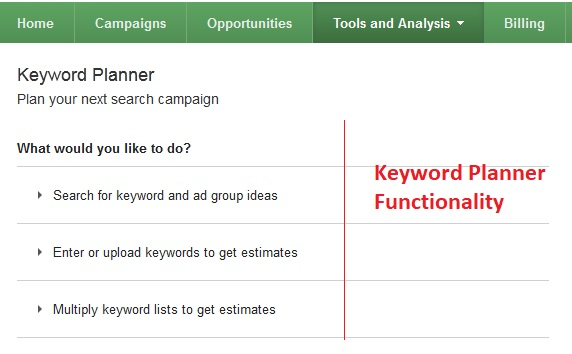
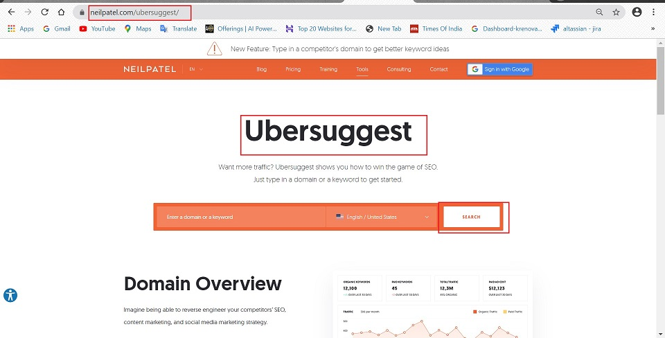

#   **Data Collection**

##  **What is Data Collection**

Data collection is the process of gathering and measuring information on targeted variables in an established system, which then enables one to answer relevant questions and evaluate outcomes.

Data collection is the systematic approach to gathering and measuring information from a variety of sources to get a complete and accurate picture of an area of interest.

The **goal** for all data collection is to capture quality evidence that allows analysis to lead to the formulation of convincing and credible answers to the questions that have been posed.

Accurate data collection is essential to maintaining the integrity of research, making informed business decisions and ensuring quality assurance. 

##  **Benefits of Data Collection**

When conducting research, collecting original data has significant advantages:

-   You can tailor data collection to your specific research aims (e.g. understanding the needs of your consumers or user testing your website)
-   You can control and standardize the process for high reliability and validity (e.g. choosing appropriate measurements and sampling methods)
-  It helps in understanding what is currently trending in your area, what people are more curious about, which keyword will work best at that particular time.
-  All the data collected forms an important part of [building a user persona](Building-User-Personas.md).

##  **Sources of Data Collection**

There are multiple sources of data collection. For eg: surveys, questionnaries, interviews and many more. Nowadays, digital tools help in gathering relevant data and information in a more detailed manner. Below, we will discuss a few commonly used sources:

### **Google Analytics**

Google Analytics is a free web analytics service/tool offered by Google that tracks/monitor and analyse/reports website traffic. It is the most widely used web analytics service on the web.

**Google Analytics is used to :**

-   Track website activity based on some parameters of individuals using the site , along with the information on the source of the traffic.
-   It shows high level, dashboard type data for the casual user.
-   E-commerce tracking can track sales activity and performance.

**Who can view analytics of a Website?**

Access to the analytics being collected for any particular website is limited to those who have login access to the Google Analytics account.

Once, the access is available, the relevant data can be downloaded in form of Excel sheets.

**What Data does Google Analytics collect?**

At its most basic, Google Analytics can collect a lot of data about how people use a website. For eg:

-   Time of visit, pages visited, time spent on each of the webpage.
-   Referring site details (such as a URL through which the user reaches the website)
-   Type of browser
-   Network location and IP Address

With some custom implementation, additional data can be collected which might include:

-   Document downloads
-   clicks on links leading to external websites
-   errors when users fill out forms
-   clicks on videos
-   scroll depth
-   interactions with site specific widgets.

With Google's latest version of Google Analytics, even more data which is not limited to websites, can be tracked:

-   app activity
-   telephone conversations
-   Point of sale transactions
-   RFID or NFC sensor activity

**How does Google Analytics work?**

1.  Google Analytics works via a “page tag”. The page tag is called the “Google Analytics Tracking Code”, and it is a snippet of JavaScript code.
2.  This code is added to every page of the website to be tracked. 
3.  When someone visits the website, the tracking code runs in the visitor’s browser, collects visitor data, and sends it to a Google data collection server.
4.  The usage data is then stored in Google's data collection server.

**How to start tracking users on a website?**

Google Analytics is free to use. All you need are:

-   a Google account
-   a website to track (and the ability to add the Javascript snippet to that website)

>:computer: [Guide to Google Analytics](https://www.mattlane.co.nz/2014/10/09/an-idiots-guide-to-google-analytics/)

>:computer: [How Google Analytics works](https://www.analyticsmarket.com/blog/how-google-analytics-works/)

>:computer: [Video guide to Google Analytics](https://www.youtube.com/watch?v=gBeMELnxdIg)

### **Secondary Research Methods**

Secondary research is a research method that involves using already existing data. Existing data is summarized and collated to increase the overall effectiveness of research.

Secondary research is much more cost-effective than primary research, as it makes use of already existing data, unlike primary research where data is collected first hand by organizations or businesses or they can employ a third party to collect data on their behalf.

There are many popularly used secondary research methods. In this section, we will discuss some of the methods/ tools available on the internet.

####    **Google Trends**

Google Trends is a **free** website by Google that analyzes the popularity of top search queries in Google Search across various regions and languages. The website uses graphs to compare the search volume of different queries over time.

The vast amount of searches — trillions taking place every year — make Google Trends one of the world’s largest real time datasets.

**How is Google Trends useful?**

-   Google Trends allows the user to compare the relative search volume of searches between two or more terms.
-   Examining what people search for provides a unique perspective on what they are currently interested in and curious about.
-   It allows users to measure interest in a particular topic across search, from around the globe, right down to city-level geography.
-   Data can be filtered in two ways: **Real time** (searches from last 7 days) and **non-real time** (dataset ranging anywhere from 2004 to ~36 hours ago).

**How to access Google Trends?**

1.  Go to -> trends.google.com
2.  Enter a search term or a topic.

>:computer: [Google Trends Guide](https://medium.com/google-news-lab/what-is-google-trends-data-and-what-does-it-mean-b48f07342ee8) - Learn more about Google Trends

####    **BuzzFeed**

BuzzFeed is an American Internet media, news and entertainment company with a focus on digital media. The primary focus is on tracking viral media and provide trends across different areas of interest.

####    **BuzzSumo**

BuzzSumo is a powerful online tool that allows any user to find out what content is popular by topic or on any website. In order to provide the content that people want to know, you need to know what it popular - this is where BuzzSumo is helpful. It is a paid service.

BuzzSumo can do the following for any business:

-   **Content Insights** : Searching across multiple social sites, Buzzsumo gathers information on what topics are gaining the most attention. It analyzes where certain topics are being discussed and how much attention these topics are getting.
-   **Influencer Information** : Who are the people that others are listening to the most? Who gets more social media shares on their posts? Knowing who has the public’s attention and trust can give you insight on who you need to follow and get on your side.
-   **Alerts** : Buzzsumo allows you to set up keyword alerts, so you are updated when content is posted or updated. This allows you to be able to know what your next step should be in regards to your own marketing efforts.
-   **Competitor Analysis** : Knowing what your competitors are doing, and what is working or not working for them, goes a long way in helping you. It helps you avoid ineffective things and gives insight into waht works best and where you stand in comparison to competitors.

####    **Keyword Planner (Google Ads)**

Keywords are words or phrases that are used to match your ads with the terms people are searching for.

Selecting high quality, relevant keywords for any advertising campaign can help you reach the customers you want, when you want.

The Google Adwords Keyword planner is an incredibly useful and powerful keyword research. It helps you research keywords for the Search Campaigns.

Some benefits of the Keyword Planner are as below:

-   **Discover new keywords** : Get suggestions for keywords related to your products, services, or website.
-   **See monthly searches** : See estimates on the number of searches a keyword gets each month.
-   **Determine cost** : See the average cost for your ad to show on searches for a keyword.
-   **Organize keywords** : See how your keywords fit into different categories related to your brand.
-   **Create new campaigns** : Use your keyword plan to create new campaigns centered on in-depth keyword research.

The Keyword functionality is exposed via a wizard-like interface, as shown below:

>:computer: [Keyword Planner Tutorial](https://www.wordstream.com/blog/ws/2013/04/25/keyword-planner)

>:computer: [How to use Keyword Planner](https://support.google.com/google-ads/answer/7337243?hl=en)

>:computer: [Keyword Planner Video Tutorial](https://www.youtube.com/watch?v=m4SaXPVidWk)

####    **Ubersuggest**

Ubersuggest is a free SEO tool that specializes in generating new keyword ideas.

Ubersuggest allows you to get insight into the strategies that are working for others in your market so you can adopt them, improve them, and gain an edge.

**Key Features**

1.  **Keyword Ideas** : “Keyword Ideas” is the feature that put the original Ubersuggest on the map. And it still works GREAT.

    -   To use it, type in a keyword. Ubersuggest will find long tail versions of the term typed.
    -   These suggestions are great if you are sure about a certain topic.
    -   Ubersuggest can be used to generate different types of keywords, including:

        -   Related
        -   Questions
        -   Prepositions
        -   Comparisons

2.  **Keyword Overview** : This tool gives you important data on a keyword that you type into it. So instead of listing out a bunch of ideas, this is like using a magnifying glass on a single term. Here's a breakdown of the info: 

    -   Overview and Search Volume Treand
    -   Average Backlinks and Domain Score
    -   Content Ideas

3.  **Content Ideas** : Although not as feature-rich as a paid BuzzSumo account, it’s helpful for figuring out what’s already working in that space.
4.  **Traffic Analyser Overview** : Here’s where you can get a sneak peak into a competitor’s SEO efforts. Below information is available on this page:

    -   Organic Keywords
    -   Organic Monthly Traffic
    -   Domain Score
    -   Backlinks
    -   Traffic Trend Chart
    -   SEO Keywords Ranking

5.  **Top Pages** : This is a list of pages that send a site the most search engine traffic.
6.  **Keywords** : This feature is similar to “Top Pages”. But instead of seeing a competitors’ most successful SEO pages, you see the keywords that send them the most traffic.
7.  **Site Audit** : This is one of Ubersuggest’s two “SEO Analyzer” features. Like it sounds, Site Audit runs an SEO audit of your website. And gives you recommendations on what’s wrong and how to improve. Here's the break down all of the data that you get in this report:

    -   Organic Monthly Traffic, Organic Keywords, Backlinks
    -   On-page SEO Score
    -   Health Check
    -   Critical Errors
    -   Warnings
    -   Recommendations
    -   Sitespeed
    -   Top SEO Issues

8.  **Backlinks** : Backlinks is the other Ubersuggest “SEO Analyzer” feature. Below is a quick breakdown of the data from this report:

    -   Overview
    -   Backlink List
    -   Filters

9.  **Dashboard** : This is a feature that you can use to track your organic traffic, setup rank tracking, monitor your links, and more.

>:computer: [Ubersuggest Tutorial](https://backlinko.com/hub/seo/ubersuggest)

>:computer: [Ubersuggest Video tutorial](https://www.youtube.com/watch?time_continue=137&v=eXBgXnKGTAw&feature=emb_logo)
