# **Content Mapping**

## **What is a Content map?**

- A content map is a plan to deliver the right content, to the right people, at the right time. Building content maps is the first step towards making a good website. 

- It acts as a blueprint of your website. It allows you and your team to be organized and visualize what the site will become.

- It is a valuable tool when you are working with a web design company to produce your website.

## **What is Content Mapping?**

- Content Mapping focuses on how each piece of the content is strategically related to and supports the customer/client journey.

- It helps us to relate and connect to each of the phases/steps in a customer journey and helps us to deliver better and meet the needs of our target audience.

- Content mapping takes into account the characteristics of the person who will be consuming the content and their lifecycle stage.

### **Three Pillars**

To create an effective website you need to keep in mind these three pillars of content mapping which are as follows:

#### **Right Content**

This means creating valuable content for the users/customers/clients visiting your website. For example if you have build a website for fashion and clothing you have to put the content for the same and not for health and fitness because if users are visiting a website for fashion and clothing they should be shown content relevant  to fashion and clothing and not health and fitness.That will make more sense to them.

#### **Right People**

People who visit your website will be generally from differet age groups, interests and needs. By 'right people' it means if you have build a website for women clothing and showing content for men fashion trends and sales on men wear it will not generate good sales for women clothing as your content is not specific for the people you have defined.

#### **Right Time**

By right time we do not mean that your website should have different content on different dates and time. By this we meant that a user/client goes through different stages before coming to a decision. For example Mr. A has to buy a shirt and he is gathering the information for the same from different websites. So he is in the process of getting details but he visits a website whhich is showing him there is a 30% discount for the same. At that particular 'gathering the information' stage he is getting the irrelevant content which he may require later. So it becomes very important for organisations to create the content based on the lifecycle stage of the person visiting the website.

## **Benefits of  Content Mapping**

- It helps you understand your customer and lays out their   journey. 

- It gives you an overview of all the content you have and identify the holes in your content strategy. 

- It helps you get the most out of your content.

- It can double as a Keyword map.

- It aligns content with personas.

- It helps customers through their purchase funnel.

## **Content Mapping activity**

A Content Mapping Activity is divided into two sections as follows:
 
**1.** User/Buyer persona

**2.** Lifecycle Stages

### **User Persona**

Personas and content mapping go hand in hand. You can't create a useful, accurate content map without developing an in-depth user/buyer persona first. 

#### **What it is?**

- A user persona is a detailed description of your ideal audience. It helps you get to know your customers and understand what they know, want, and need.

- It help businesses understand and empathize with their customers so they can do a better job of acquiring and serving them.

- A persona is about perception. For example in the business world, for instance if a businessman wants others to think that he is very powerful and successful, he might drive a fancy car, buy a big house, wear expensive clothing, and talk down to people that he thinks are below him on the social ladder.

#### **Sources to gain information**

While strategisisng you need to know what is currently trending in your area, what people are more curious about, which keyword will work best at that particular time. So the one strategising a content map for a particular website will do a research for the keywords and other important news to gain information in detail. Some of the online tools from where any user can find out which content/keyword is popular by topic. Some of the tools are given below.

**1.Google Trends**

It is a search trends feature that shows how frequently a given search term is entered into Google’s search engine relative to the site’s total search volume over a given period of time. It can be used for comparative keyword research and to discover event-triggered spikes in keyword search volume.

Google Trends provides keyword-related data including search volume index and geographical information about search engine users.

You can use the data found in Google Trends for several different marketing purposes:

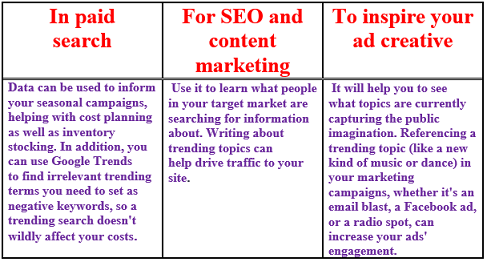

**2.BuzzSumo**

It is powerful online tool that allows any user to find out what content is popular by topic or on any website.
It can take hours scanning all the various social sites to find out what people are talking about and what their concerns and needs are. Being able to input certain search criteria, analyzing content and finding out what is already working in your area can be priceless to a marketer to help sharpen your focus and give you direction. 

**2.BuzzFeed**

It is the leading independent digital media company delivering news and entertainment to hundreds of millions of people around the world and taking the social web by storm.
It leverages data and innovation to reach millions globally.
So you can gather information about the trending topics and get aware and create a content map based on that.

#### **Keyword Mapping and Research**

- It is the process of assigning relevant keywords to the different pages on a website based on thorough keyword research. 

- It is a framework for the keywords you have chosen to target that mirrors your site's structure.

- It is an important aspect of on-page search engine optimization that will allow search engines to see the page’s relevancy based on a user’s search. 

- The ultimate goal of this map is to help you discover where to optimize, what content to build, and where you can add new pages to attract more traffic/users.

**Step by step guide for keyword research:**

**1. BuzzSumo**

- You can visit <https://buzzsumo.com/> and type any word in the search bar and see the searches for that particular word.

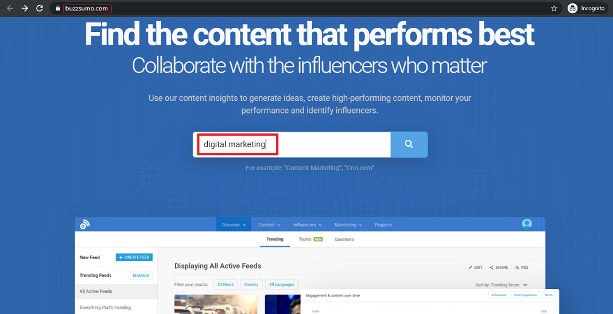

- For example for the word digital marketing here you can see  the searches in number.

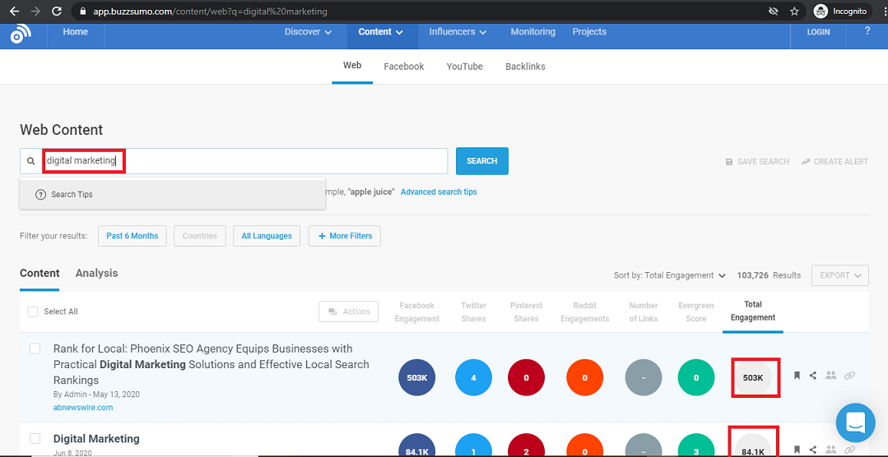

**2. Google Trends**

- Visit <https://trends.google.co.in/trends/?geo=IN>

- In the image given below you can choose any country wich you want to look for.

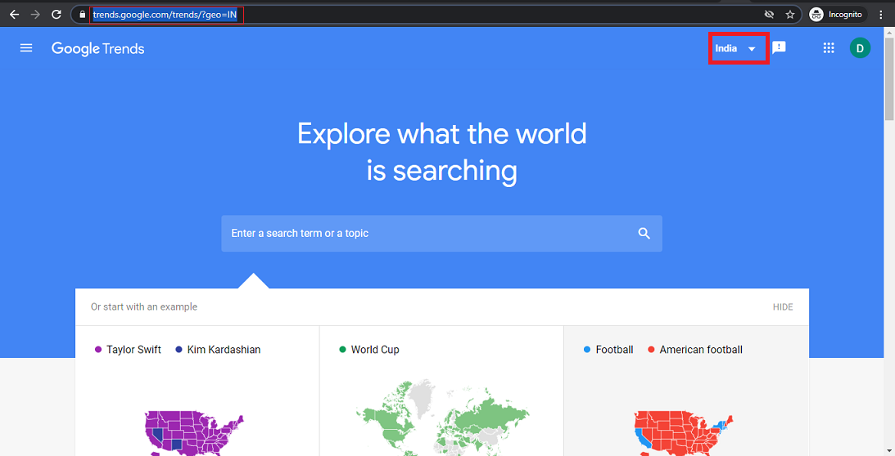

- For example here country is selected as India. You can change it to any other country.

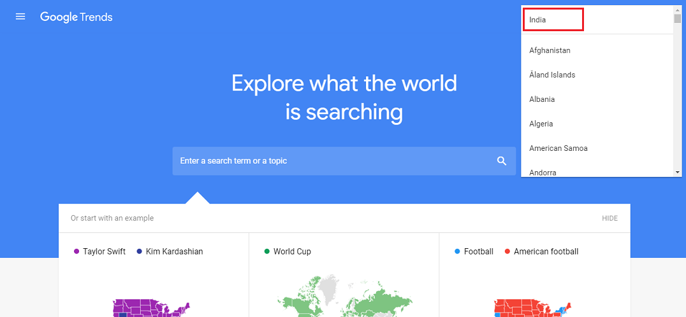

- In the search bar you can type any word for which you want to check like the word business is searched in the below image.Then you are ready for search.

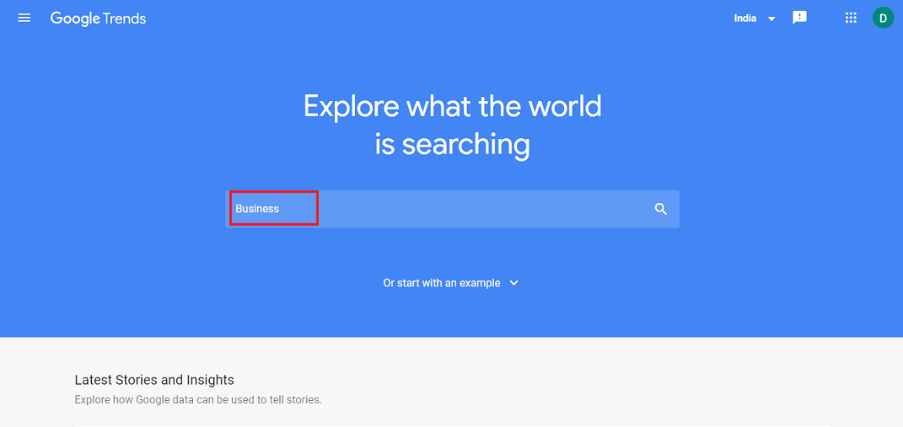

- The graph here is representing the number of searches for business word and the green tabs are for filter. You can change it accordingly. 

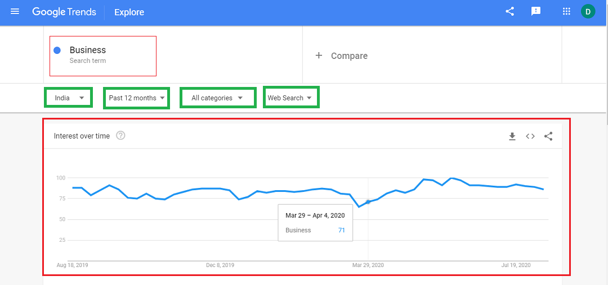

- India has been selected here. You can select according to your requirements. 

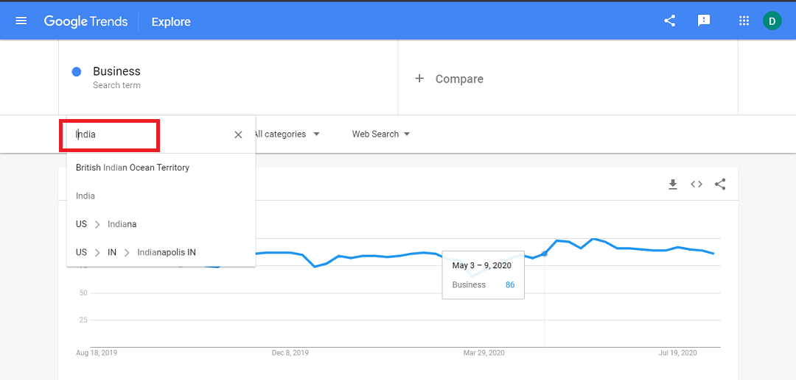

- From this tab you can select the time period for which  the graph should be represented. Like here it is selected as 'Past 12 months'. 

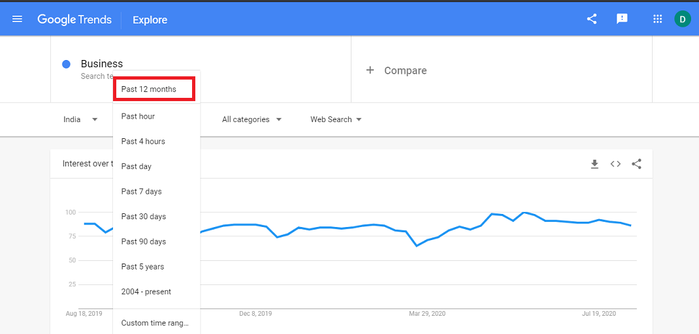

- Here you can filter search as per your requirements. 'pets and animals' have been selected here. The graph will look different as you can see in the image below.

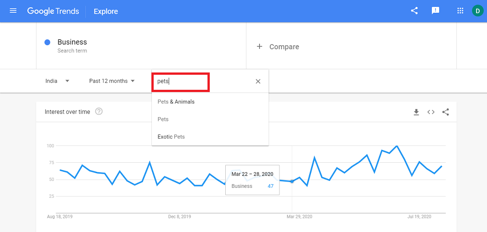

- 'Web search' has been selected here. You can change it accordingly.

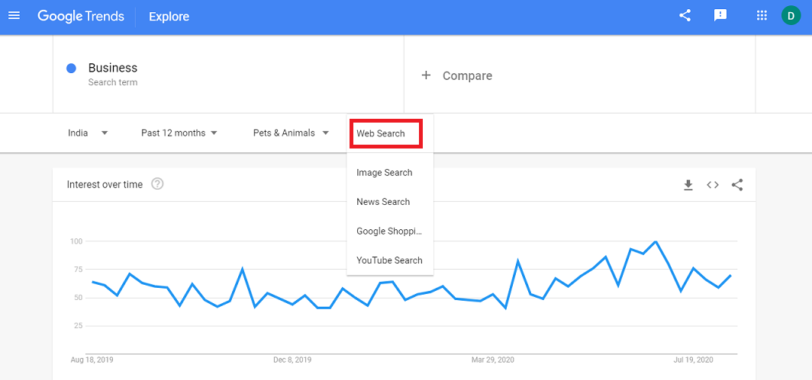

- You can click on the " + compare " button for the comparison between the words for the number of searches. For example here two words have been added cat and dog. Now it will start showing you three lines in the graph. Here business, cat and dog words are represented by blue, red, yellow lines respectively. 

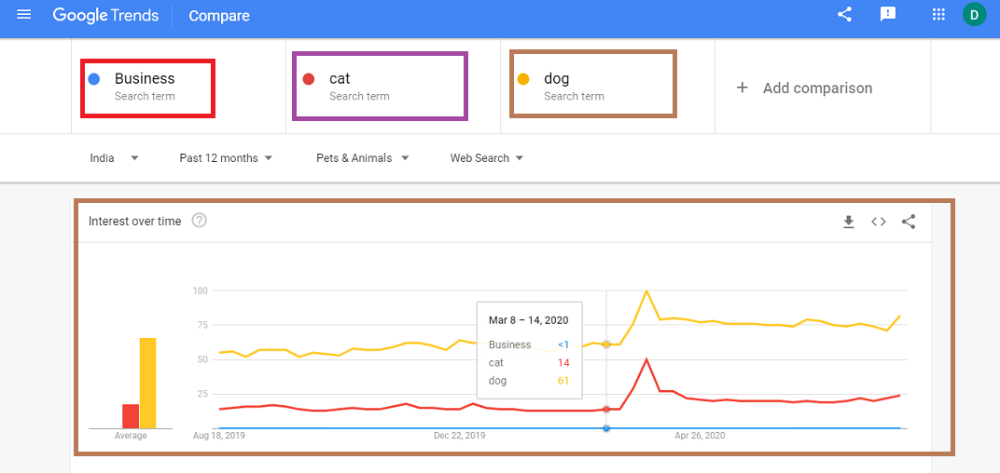

- You can this download this data for further process.

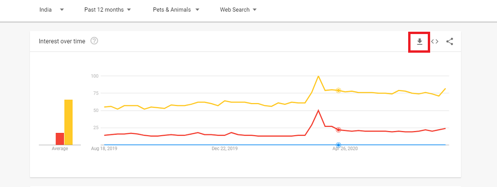

- Excel sheet will be generated automatically after you download the graph data

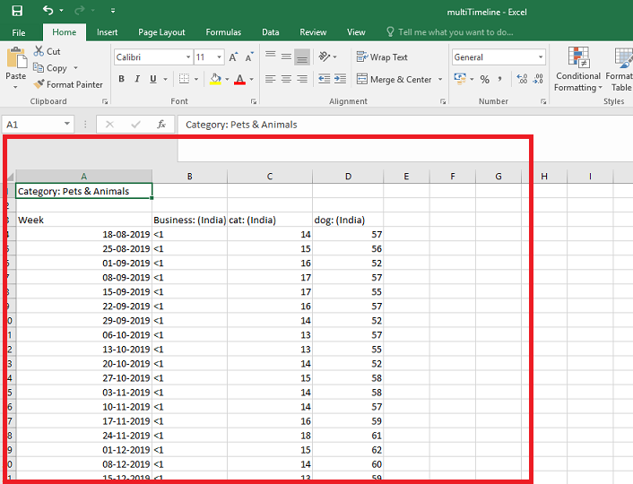

- You can download this data region-wise.

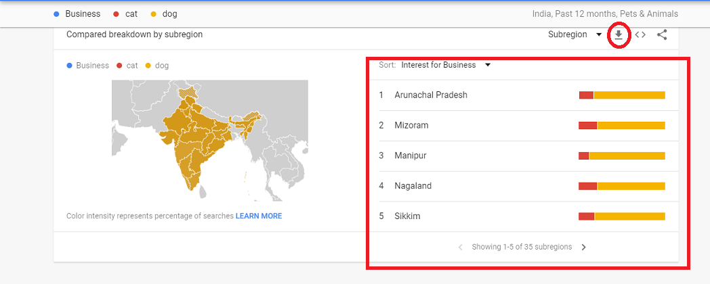

- After downloading the region-wise data you can see another excel sheet generated on your screen.

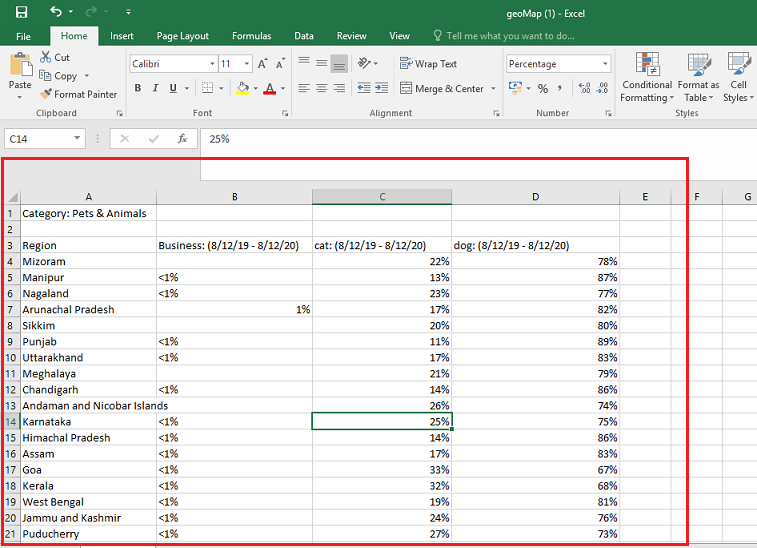

- Click on the left topmost symbol as shown in the figure.

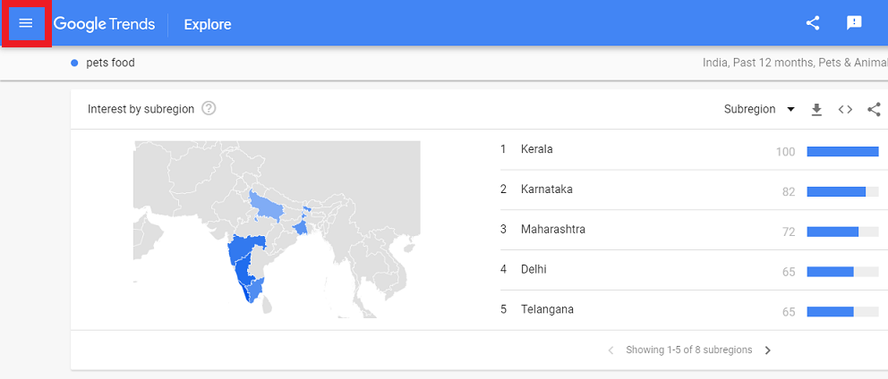

- Click on the 'Trending Searches' to get the trending topics. It will update you on hourly basis and will show you the old data in the 'daily search trends' and 'real time search trends respectively. Check out the images given below:   

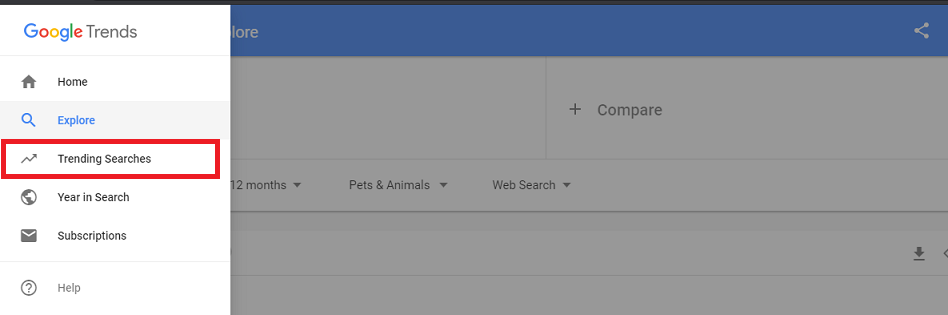

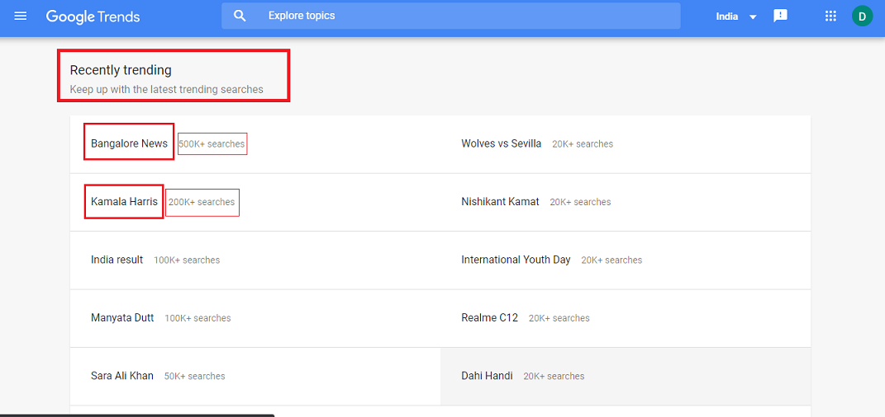

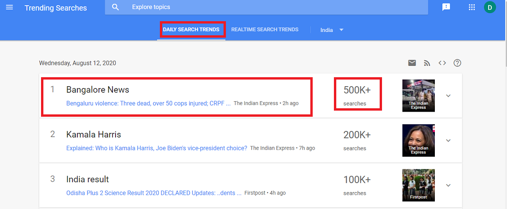

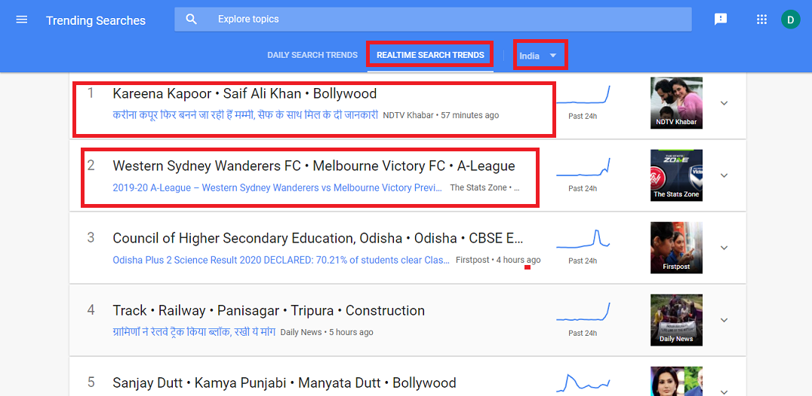

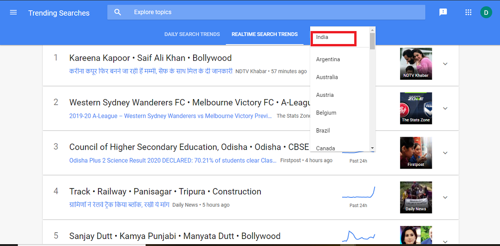

### **Lifecycle Phases**

This outlines the journey of a user throughout from seeking information about ways and methods about your product/service to the finalised service/product they are interested to avail/buy which can meet their needs.

It outlines five stages of the customer journey:

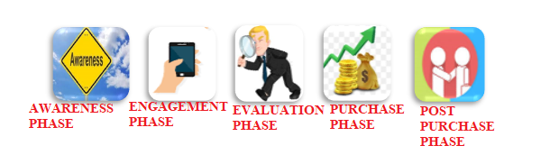

**1. Awareness Phase:** In this phase a prospect becomes aware of a need. They begin seeking fulfilment of that need, a solution to a problem, or an answer to a question. During their search, they start to notice a brand for the first time. They become aware of the company, gain a broad understanding of who they are and what they offer, and start to see how the brand could help them.

**2. Engagement Phase:** In this phase, a customer is already familiar with a brand, and they are learning more about them. The brand and the prospect have formed some sort of connection as the prospect gathers information that helps them in some way. The prospect may have followed the brand on social media, opted in for a newsletter, or signed up for a free trial or content upgrade.

**3. Evaluation Phase:** By this phase, the prospect already knows that the brand can solve their problem or provide what they need but they are still considering if the brand is the best available solution. They do research and compare the brand to others in the market.

**4. Purchase Phase:** During this phase, the prospect turns into a paying customer. They have decided on a brand and are ready to buy. They just need the tools, process, and path to make their purchase.

**5. Post-purchase Phase:** The customer journey does not end once the prospect makes a purchase. Customers at this point may need additional support or services, and they are also primed to buy again.

**Helps and Guides:**

<https://www.bizcommunity.com/Article/196/16/176195.html>
