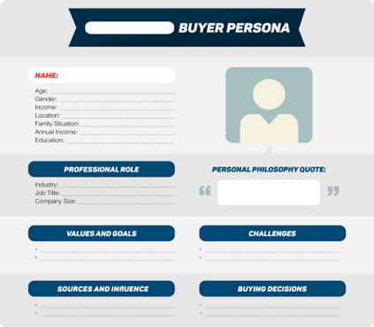
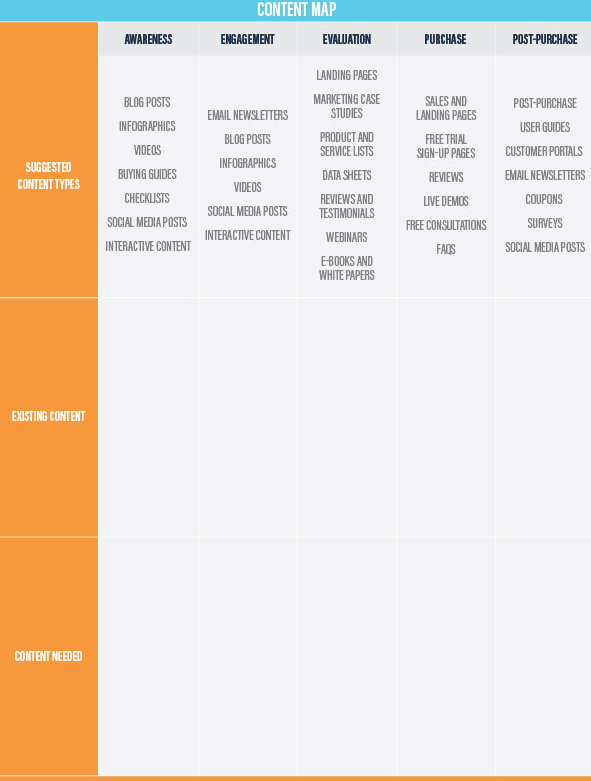

# **How to create a Strategic Content Map**

## **Step 1. Create a buyer persona to understand your audience.**

A [buyer/user persona](Building-User-Personas.md) typically outlines the following characteristics of the ideal buyer:

- **Demographics:** It includes age, gender, income, location, family situation, income, education, etc.

- **Professional Role:** It mainly focuses on Industry, job title, company size

- **Values and Goals:**  What the user believe strongly in,
professional and personal goals, values, lifestyle details

- **Challenges:** What challenges the user is facing, pain points, fears, issues at work or home

- **Sources and Influences:** What are their favorite blogs, books, thought leaders, conferences

- **Buying Habits:** What objections they keep before buying, where from they buy, how long it takes them to buy, who makes the buying decisions.

Check out the image given below:
 

## **Step 2. Document the journey your customer takes on their way to doing business with you.**

- Once you have a clarity of who your ideal customer is, the content mapping process will be easier. You can use what you know about your ideal buyer to [create a customer journey map](Building-User-Lifecycle.md) that illustrates the path that person takes on their way to doing business with you.

-   [User Journey](Building-User-Lifecycle.md)

- It also focuses on customer experiences at each stage of the marketing funnel. It may document the details for each phase. 

    **Customer Actions:** What the customer is doing like performing a Google search, visiting a website etc.

    **Customer Questions and Thoughts:** What the customer is thinking about price, competitors, the offering’s ability to solve problems, etc.

    **Branded Touch Points:** The branded customer platforms or interactions the customer experiences visiting your website, visiting a physical store location, speaking with customer services reps, etc.

    **Brand Opportunities:** What your brand can offer to customers to help and support them based on their actions, questions, thoughts, and the touch points they experience in that phase of the marketing funnel.
    
- After laying out the customer journey it’s more clear what content you should create to attract, nurture, and guide customers during their journey.  

## **Step 3. Understand what content works best in each phase of the customer journey.**

**Awareness** content or top-of-funnel content attracts new audiences to your brand and helps prospects find answers to the questions they ask when they have a requirement.

**Engagement** content keeps audiences interested in your brand so that when they are ready to buy, they choose your company.

**Evaluation** content or middle-of-funnel marketing content helps inform customers as they decide if your brand, products, and services are a fit for what they require. 

**Purchase** content or bottom-of-funnel content is what customers interact with when they are ready to buy. It targets buyer keywords and helps customers feel confident in making their purchase.

**Post-purchase** content supports customers after their purchase and also re-engages and remarkets to them to bring them back into the purchase funnel. 

## **Step 4. Create a catalog of the content you have.**

Perform a content audit and create a catalog of all the content you have which will prevent you from creating duplicate or redundant content assets.

List each piece of content and relevant details as given in the image below:

Refer the below link to get more info about creating catalog:

<https://blog.alexa.com/use-content-audit-template-assess-measure-plan-future/>

## **Step 5. Map existing content to relevant phases of the customer journey.**

The things you should consider while filling your content map:

**The type of content**

As mentioned earlier, certain types of content work better in certain phases of the customer journey. Look at the type of content and decide where it best aligns with the phases of your content map.

**The content’s conversion point**

As you consider where the content belongs in the map, also look at what the content tells the audience to do next. Make sure the call to action at the end of the content guides the customer to the next phase of the buyer’s journey.

**The quality of the content**

Not all of your existing content may belong in your content map. If you find that the quality of an existing piece of content is low, don’t use it in your content mapping. Leave it out and make a note that it could be revised later.

## **Step 6. Create targeted content for gaps in your content map.**

- Identify parts of your funnel that have inadequate/shallow content and create a plan for filling those gaps.

- You can gp back to your catalog of existing content and look for ways to repurpose what you have and use it in other phases of the funnel.

