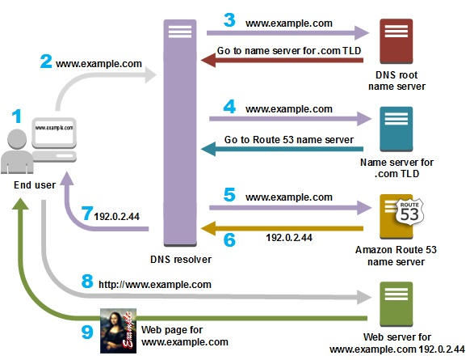
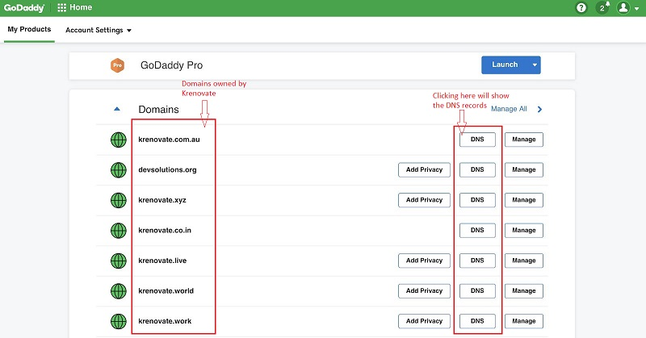
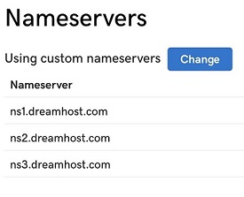
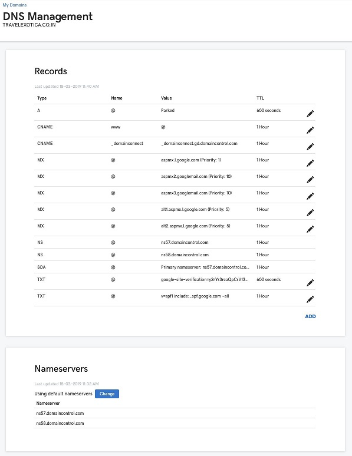
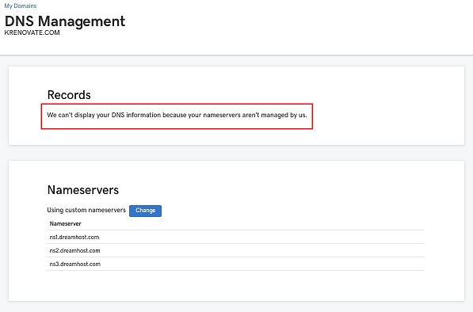
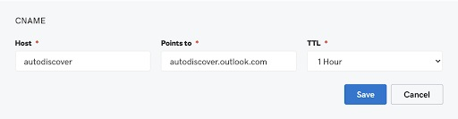
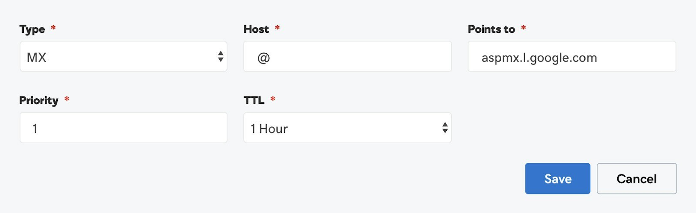
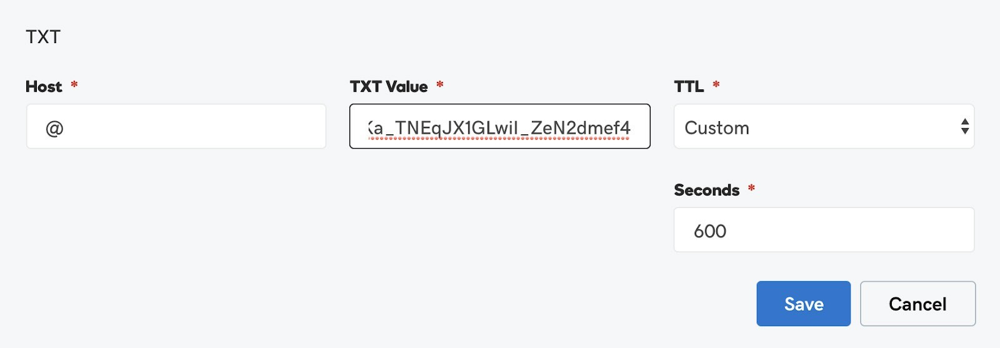

# **Domain Name Systems**

## **What is DNS**

DNS stands for **Domain Name System**. It is a standard protocol that helps Internet users discover websites using human readable addresses. Like a phonebook which lets you look up the name of a person and discover their number, DNS lets you type the address of a website and automatically discover the Internet Protocol (IP) address for that website.

In other words:

DNS connects URLs with their IP address. With DNS, it’s possible to type words instead of a string of numbers into a browser, allowing people to search for websites and send emails using familiar names. When you search for a domain name in a browser, it sends a query over the internet to match the domain with its corresponding IP. Once located, it uses the IP to retrieve the website’s content. Most impressively, this whole process takes just milliseconds.

Few examples:

-   the domain name www.ns1.com, translates to the IP address 104.20.48.182
-   the domain name www.amazon.com is translated to machine readable IP address 192.0.2.44

We can also define DNS as the control panel for the domain names we buy on websites like Godaddy. 

>:computer: [What is DNS - Video Tutorial](https://dnsmadeeasy.com/support/what-is-dns/)

>:computer: [More about DNS](https://www.namecheap.com/dns/what-is-dns-domain-name-system-definition/)

##  **Uses of DNS**

The classic use of DNS is to translate the domain name in a URL into a corresponding IP address. But DNS has many more uses - it underlies many other forms of Internet communication:

-   Resolving names of World Wide Web (www) sites
-   Routing messages to email servers and webmail services
-   Connecting app servers, databases and middleware within a web application
-   Virtual Private Networks (VPN)
-   Peer-to-peer sharing programs
-   Multiplayer games
-   Instant messaging and online meeting services
-   Communication between IoT devices, gateways and servers

## **How DNS works**

The process of DNS resolution involves converting a hostname (such as www.amazon.com) into a computer-friendly IP address (such as 192.0.2.44). An IP address is given to each device on the Internet, and that address is necessary to find the appropriate Internet device - like a street address is used to find a particular home. When a user wants to load a webpage, a translation must occur between what a user types into their web browser (amazon.com) and the machine-friendly address necessary to locate the amazon.com webpage.

Below image shows how exactly a DNS works:

>:computer: [How DNS works - Video Tutorial](https://www.youtube.com/watch?v=mpQZVYPuDGU)

##  **How to access DNS records**

We can access the DNS records of our domain by logging into our domain management account. At Krenovate, we generally use Godaddy to buy domains.The below image is a snapshot of the account we have at Godaddy to manage the domains we own.

It has various domains bought by our organisation. If we look closely, in front of every domain name we will find a prominent button with the CTA ‘DNS’. By clicking this we will reach the DNS records of the respective domain name. 

##  **Records in the DNS System**

DNS system allows us to manage multiple things through the different set of records available in the DNS system. We will discuss the most important records in the DNS, which are as follows:

>**1. Nameservers**

<!-- -->
>**2. A records**

<!-- -->
>**3. CNAME Records** 

<!-- -->
>**4. MX Records**

<!-- -->
>**5. TXT Records**

### **Nameservers**

A nameserver is a specialized server on the Internet that handles queries or questions from your local computer, about the location of a domain name’s various services. 

Simply put, a nameserver helps browsers make connections between URLs and websites. They’re incredibly important, as without them, we would have to memorize IP addresses in order to access websites.

A nameserver maintains a directory of domain names that match certain IP addresses. In other words, it’s where the DNS server records for your domain are stored, allowing you to decide which hosting providers controls your webspace and email. 

This process works so quickly that it’s almost never noticeable. You simply type in a URL, the nameserver lets your browser know where that website is located, and the desired page loads.

Nameservers help us identify the hosting service for the particular domain name. For example, if we have to host a domain on "Dreamhost" which is a web hosting service, we have to point the domain to Dreamhost using the Dreamhost nameservers.

Each domain is pointed to a minimum of two nameservers. Nameservers are always managed from the domain management account. Look at the following image, which is a snapshot of the nameservers of Krenovate.com

As we can see in the above image nameservers of Krenovate.com point to Dreamhost,
making it clear that www.krenovate.com is hosted on Dreamhost. 

Nameservers are generally written in the format ‘ns1.servername.com’. Also, the particular nameservers help us identify the place from where we can manage the DNS records. DNS records are always available and can be modified from the hosting service provider of the website. If we have to make any changes to the DNS records of Krenovate.com, we will have to do the same in our Dreamhost Hosting Account.

The domain provider and the hosting service provider can be same or two different entities for every website. We will discuss both the cases one by one for a better understanding:

The following table will help you understand where you will manage your DNS records and nameservers in the below mentioned scenarios.

| Domain Management| Scenario 1 | Scenario 2
| -------- | ----------- | -----------|
| **Nameservers** *The nameservers are always managed through domain provider account.*  | Godaddy |Godaddy |
| **DNS Records** *The DNS records are always managed through hosting provider account.* | Godaddy | Dreamhost |

#### **Scenario 1**

In this case, the Domain Provider and Hosting Provider are the same.This simply means that you bought a domain on **Godaddy** and have also bought **hosting services** from Godaddy itself.

In the below image, you can see and manage both nameservers and DNS records from your Godaddy account.

#### **Scenario 2**

In this case, Domain Provider and Hosting Provider are different. This is the scenario of **Krenovate.com**, the domain name **Krenovate.com** has been bought and managed on **Godaddy**, while the website **Krenovate.com** is **hosted on Dreamhost**.

The following image will show you that you can only see and manage nameservers from your Godaddy account and it says DNS records cannot be displayed as nameservers are pointed to Dreamhost.

### **A Records**

The A (Address) Record is the most important record as it points your domain name to the relevant IP address. 

The following image will show you how to add or edit an A Record in your DNS Records.

 A Record has the following elements:

- **Type of Record** - A Record
- **Host** - @ The host name for the record, without the domain name.
- **Points to** - The IP address of hosting server
- **TTL** - Time to go live

### **CNAME Records**

 A CNAME record is a type of DNS record that’s used to point a domain name to another domain name, instead of an IP address. CNAME Records are used for managing the subdomains of a website.

The following image will show you how to add or edit a CNAME Record in the DNS Records.

A typical CNAME Record has the following elements:

- **Type of Record** - CNAME Record
- **Host** - The name you want to keep for your subdomain
- **Points to** - The IP Address of hosting server of the subdomain
 - **TTL** - Time to go live

### **MX Records**

MX Record stands for **Mail Exchanger Record**.It is a type of DNS record that defines a mail server to handle email for a particular domain name. A MX Record directs email to a particular mail server. Like a CNAME, MX Entries must point to a domain and never point directly to an IP address.

 For example, email ID sharmapuneet@krenovate.com has been running on GSuite, the business version of Gmail. The following image will show you how to add or edit an MX Record in the DNS Records.

A typical MX Record has the following elements:

- **Type of Record** - MX Record
- **Host** - @ (This means that you are running email services on your domain name)
- **Points to** - The hosting address of email provider (In this case the hosting provider is Google)
- **Priority** - Generally email providers will share multiple MX records with you, and a priority for each of them as well.
- **TTL** - Time to go live

### **TXT Records**

The TXT Records are text records which are generally used for verifying ownership of a domain name. Many online service providers, in order to activate their services on your domain name, instruct you to add a custom and unique TXT Record. For example to activate Gsuite on our domain for emailing, we have to add the following TXT Record:

A typical TXT Record has the following elements:

- **Type of Record** - TXT Record
- **Host** - @ (This means that you are pointing to your own domain name)
- **TXT Value** - The unique text record shared by some other organisation
- **TTL** - Time to go live

##  **Help & Guides**

For more information about DNS and it's features, refer to below links:

-   [DNS Tutorial](https://www.wpbeginner.com/glossary/dns/)

-   [DNS Records](https://www.youtube.com/watch?v=6uEwzkfViSM)