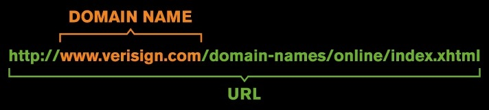
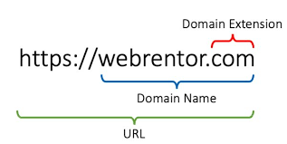
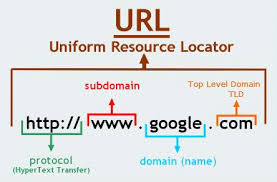
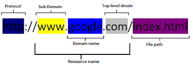
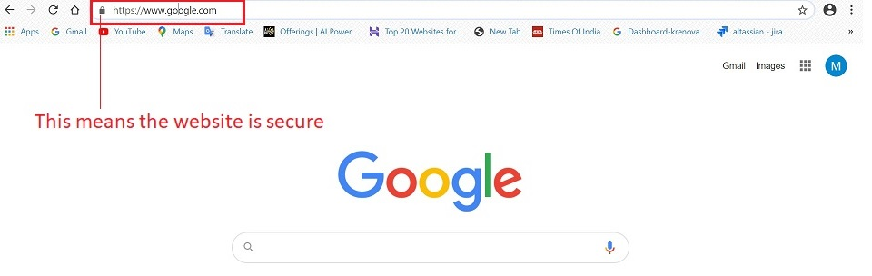
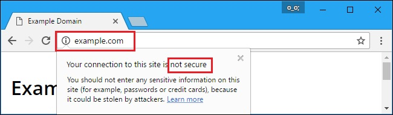
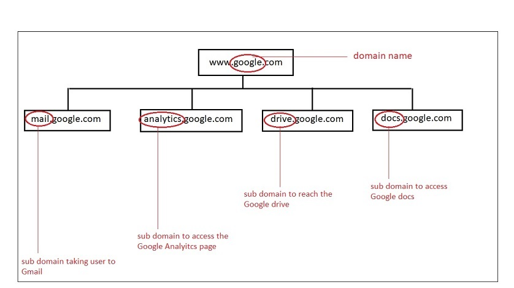

# **Domain**

## **Domain Name**

A domain name is the address of your website that people type to visit your website. 

In simple terms, if your website was a house, then the domain name will be its address. 

In the same way that a GPS needs a street address or a zipcode to provide directions, a web browser needs a domain name to direct you to a website.

Let's take a look at what goes on behind that domain:

Every website is identified by a unique series of numbers called an IP address. This numeric set is what your computer uses to connect to the server where the website data lives.

4.87.97.110 - This is how an IP address looks like.

Numbers are great for a computer, but it's easier for people to use words they can remember. The words used to identify a website are known as the domain and like the IP address, they're unique to each website. 

For example: 

Think of it like a mobile phone: you want to call your mother, so you simply click on your contact "Mom" and your phone dials your mother's phone number. Domains are connected to IP addresses in much the same way.

Let's look at some examples for domain names:

|URL | Domain Name |
|:---------|----------:|
 https://www.wpbeginner.com | wpbeginner |
 https://www.hostinger.in | hostinger | 
 https://www.lucidchart.com | lucidchart | 

### **Purpose of a Domain Name**

If you have a website, it needs to have an address, and that address needs to have a name. Other good reasons to register a Domain name are:

1.  Domain name gives a unique identity to your business.
2.  Once registered, no one else can take that name. So, you can register a domain by your personal name, company name or other things important to you.
3.  Having a registered domain also helps you get a personalised email address. Such email ids are easier to remember by customers.
4.  Having your own domain name, website and email addresses will give you and your business a more professional look.
5.  Having a registered domain name to protect copyrights and trademarks, build credibility, increase brand awareness, and search engine positioning.

### **How does a Domain Name work?**

Domain names work because they provide computer users with a short name that is easy to remember. Users enter web addresses into the URL field at the top of their browser's page from left to right. The domain name itself is read from right to left according to the naming hierarchy discussed below. This link provides directions to the network, which ultimately results in a successful page load at the client end of the transaction.

>:computer: [More info on Domains](https://www.wpbeginner.com/beginners-guide/beginners-guide-what-is-a-domain-name-and-how-do-domains-work/#definition)

>:computer: [Domains Tutorial](https://www.namecheap.com/domains/domain-definition-what-is-a-domain-name/)

## **URL**
A URL (*__“Uniform Resource Locator”__*) is a complete web address used to reach a particular web destination.

Many times people confuse domain name for URL and vice a versa. But, a domain name is part of a URL. You can see the visual difference in the following examples:

A URL has four major parts which we will discuss in detail in the next section:

**1. HTTP / HTTPS**

**2. TLD** 

**3. Domain** 

**4. Sub Domain**

### **HTTP/HTTPs** 

####    **What is HTTP?**

**HTTP** stands for **H**yper **T**ext **Transfer** **P**rotocol

HTTP is an application protocol that allows communication between different systems. Most commonly, it is used for transferring data from a web server to a browser to view web pages.

**Purpose of HTTP**

HTTP was invented alongside HTML to create the first interactive, text-based web browser: the original World Wide Web. Today, the protocol remains one of the primary means of using the Internet.

**Advantages of HTTP**

-   HTTP can be implemented with other protocol on the Internet, or on other networks
-   HTTP pages are stored on computer and internet caches, so it is quickly accessible
-   Platform independent which allows cross-platform porting
-   Does not need any Runtime support
-   Usable over Firewalls! Global applications are possible
-   Not Connection Oriented; so no network overhead to create and maintain session state and information

>:computer: [More about HTTP](https://www.extrahop.com/resources/protocols/http/)

####    **What is HTTPs?**

**HTTPs** stands for **H**ypertext **T**ransfer **P**rotocol **S**ecure.

It is the secure version of HTTP, which is the primary protocol used to send data between a web browser and a website. HTTPS is **encrypted** in order to increase security of data transfer. This is particularly important when users transmit sensitive data, such as by logging into a bank account, email service, or health insurance provider.

HTTPs uses an encryption protocol called **SSL certificates** to encrypt communications.

    **SSL Certificate** - SSL stands for Secure Sockets Layer. SSL Certificate is a data file issued by the authorised Certificate authority. The SSL certificate contains the owner's public key and other details. The web server sends a public key to the browser through an SSL certificate and the browser verifies it and authenticates the web server using the SSL certificate. Any https website will have a padlock Secure in the addressbar, as shown below.

**Advantages of HTTPS**

-   In most cases, sites running over HTTPS will have a redirect in place. Therefore, even if you type in HTTP:// it will redirect to an https over a secured connection
-   It allows users to perform secure e-commerce transaction, such as online banking.
-   SSL technology protects any users and builds trust
-   An independent authority verifies the identity of the certificate owner. So each SSL Certificate contains unique, authenticated information about the certificate owner.

>:computer: [More about HTTPs](https://ahrefs.com/blog/what-is-https/)

>:computer: [HTTPs Tutorial](https://www.cloudflare.com/learning/ssl/what-is-https/)

####    **HTTP vs HTTPs**

Below we will discuss the differences between HTTP and HTTPs and see which option is better:

|Parameter | HTTP | HTTPs |
|---------|----------|--------- |
| Protocol | It is hypertext transfer protocol. | It is hypertext transfer protocol with secure. |
| Security| It is less secure as the data can be vulnerable to hackers. | It is designed to prevent hackers from accessing critical information. It is secure against such attacks. |
| Starts with | URLs begin with http:// | URLs begin with https:// |
|Used for | It's a good fit for websites designed for information consumption like blogs.| If the website needs to collect the private information such as credit card number, then it is a more secure protocol|
| Domain Name Validation| HTTP website do not need SSL| HTTPS requires SSL certificate|
| Data encryption| Doesn't use Encryption | Uses encryption|
| Search Ranking | Does not improve ranking | Helps to improve search rankings|
| Speed | Fast | Slower than HTTP|
| Vulnerability| Vulnerable to hackers| It Is highly secure as the data is encrypted before it is seen across a network|
|Example | | 

### **TLD**

####    **What is a TLD?**

TLD stands for **Top Level Domain**. It is the most important hierarchical part of a domain name. The TLD is the letters immediately following the final dot in an Internet address. A TLD identifies something about the website associated with it, such as its purpose, the organization that owns it or the geographical area where it originates. There are more than 1,000 TLDs available in the world. 

To make it clearer, let’s break down an example domain name  – **www.example.com**

-   example : mid level domain
-   .com : is the top level domain; it means its a commercial site.

####    **Types of TLDs**

Domain name aspects, especially TLDs, are coordinated by The Internet Corporation for Assigned Names and Numbers or ICANN. ICANN classifies TLD into four main categories based on the website’s purpose, owner, and geographical location, namely:

1.  **Generic Top-level Domains: gTLD**

    The gTLD is the most common domain that allows all range of users to register. The most familiar examples of this type of top-level domain are:

    -   .com  – for commercial sites
    -   .org  – for organizations
    -   .net  – for networks
    -   .xyz  – for general use
    -   .name  – for individuals
    -   .biz  – for businesses
    -   .info  – for information platforms

2.  **Sponsored Top-level Domains: sTLD**

    The sTLD is a type of generic top-level domain that is handled by private organizations. Users who want to register their site under this domain should comply with certain rules. Some of the sTLD examples are:

    -   .gov  – for U.S governmental sites
    -   .edu  – for educational institutions
    -   .int  – for treaty-related purpose international organizations
    -   .mil  – for the U.S. military
    -   .mobi  – for mobile product and service websites
    -   .jobs  – for legal companies or organizations
    -   .tel  – for internet communication service websites
    -   .post  – for postal service sites
    -   .asia  – for the Asia-Pacific region based websites

3.  **Country Code Top-level Domains: ccTLD**

    The country code TLD notes the location or territory ISO code. The ISO code is a two-letter code representing the name of certain areas. Common examples of this kind of TLD are:

    -   .es  –  Spain
    -   .ru  –  Russia
    -   .us  –  United States
    -   .ca  –  Canada
    -   .nl  –  Netherlands
    -   .de  –  Germany
    -   .fr  –  France
    -   .in  –  India
    -   .ch  –  Switzerland
    -   .jp  –  Japan
    -   .cn  –  China
    -   .br  –  Brazil
    -   .id  –  Indonesia

4.  **Infrastructure Top-Level Domain**

    The one and only infrastructure top-level domain available is ARPA. It stands for Address and Routing Parameter Area. It is reserved by IANA for IETF or Internet Engineering Task Force. Therefore, it is only used to solve technical infrastructure issues.

####    **Purpose of TLDs**

Since top-level domains are categorized based on what the website is associated with, it can be used to identify the website’s purpose, owner, or geographical location  – without even seeing the website’s content. For example,  the top-level domain **.edu** indicates that the website is used for educational purposes or owned by educational institutions. One thing that should be noted is that several websites could share the same name but different top-level domains. So, it can be said that “example.com” is not the same with “example.edu”.

#### **Top 10 used TLDs in the world:**

1.  .COM: 82.01 million
2.  .DE (Germany): 13.05 million
3.  .CN (China): 12.55 million
4.  .NET: 12.42 million 
5.  .UK (United Kingdom): 7.83 million
6.  .ORG: 7.79 million
7.  .INFO: 5.24 million
8.  .NL (Netherlands): 3.5 million
9.  .EU (European Union): 2.98 million
10. .RU (Russia): 2.31 million

So, if we are launching a website for a business in Europe it makes more sense to launch it under the *.EU TLD*, because people in europe would be more accustomed to open websites with *.EU TLD*.
Also there are some TLDs available which directly represent a business category, like the
*.AGENCY*, so if we are planning to open up an agency for any industry, it makes more sense to buy a domain name under the *.AGENCY TLD*.

>**[TLD's used in world](http://data.iana.org/TLD/tlds-alpha-by-domain.txt)**

>:computer: [More about TLDs](https://www.hostinger.in/tutorials/what-is-tld)

### **Domain**

Kickstarting any business online with a website starts with booking a domain name. The domain name is the key element of your website. It's crucial to choose a domain name that works best for your business, reason being:

1.  **It's the first impression** : URL is the first thing visitors will see. A good domain name can make a positive and lasting impression, while a bad domain name can send visitors running.
2.  **It affects SEO** : While exact match domains (EMDs) are no longer a necessity, keywords in your domain name can still help your SEO ranking.
3.  **It defines the brand** : The domain name is a branding opportunity! The right domain name can increase brand recognition.

Once we have shortlisted the right business/organisation category, the next step is to search and book the domain name. We should follow the guidelines given below to book a domain name:

1. Use the relevant TLDs
2. A short name is preferable than a long one.
3. Make sure it's easy to type and pronounce.
4. Avoid Hyphens and Numbers.
5. Think long-term over short-term : think of it as a marriage as it will be one of the biggest elements that define your business and brand for years.
6. Check for Trademark/ copyright: it should not be already used.
7. Use Domain name generators when stuck.

>:computer: [More about choosing domain name](https://websitesetup.org/choose-domain-name/)

####    **Where to register your Domain**

Domains can be registered using services offered by Domain registrars. These are companies responsible for registering and managing domain names for all websites around the world. Some of the best domain registrars are:

1.  [Domain](https://www.domain.com/)
2.  [Bluehost](https://www.bluehost.com/)
3.  [HostGator](https://www.hostgator.com/)
4.  [GoDaddy](https://godaddy.com/)
5.  [Namecheap](https://www.namecheap.com/)
6.  [DreamHost](https://www.dreamhost.com/)
7.  [Shopify](https://www.shopify.com/)
8.  [BuyDomains](https://www.buydomains.com/)
9.  [uniteddomains](https://www.uniteddomains.com/) 

>:computer: [Learn more about Domain Registrars](https://www.wpbeginner.com/beginners-guide/how-to-choose-the-best-domain-registrar/)

### **Subdomains**

####    **What is a Subdomain?**

Subdomains are the additional part of a domain that comes before the main domain name and domain extension. You create subdomains to help organize and navigate to different sections of your main website. Within your main domain, you can have as many subdomains as necessary to get to all of the different pages of your website.

For example: 

In the above image, we can see how Google has different subdomains to cater to the requirements of different users. 

####    **Uses of Subdomains**

There are multiple uses of having subdomains. Few of them are discussed below:

-   Most common use is to seperate a website into sections like blogs, support, e-commerce, forums etc.
-   You can create different country versions of the website (in.godaddy.com)
-   Another common use of a subdomain is creating a testing or staging version of a website.

#### **Advantages of sub domain**

1. Specific website for specific stakeholders.
2. Easy to regulate and manage content and information for a specific set of users.
3. Performance of one website does not affect the other, so if one of the subdomain crashes, the others won’t get affected (if all our hosted on separate servers).
4. Designing and planning a website becomes more easy and sensible.
5. All subdomains can eventually run as individual entities.
6. Good for organisations which deal with seperate kind of stakeholders.

Please remember, creating subdomains for different products or services is not beneficial as subdomains are only helpful if we have multiple stakeholders. To be more clear, create subdomains only if you have different stakeholders like customers, vendors, suppliers, employees and prospective customers and that too if it cannot be handled on a single website.

>:computer: [More on Subdomains](https://in.godaddy.com/help/what-is-a-subdomain-296)

>:computer: [Subdomains Guide](https://www.wpbeginner.com/glossary/subdomain/)

>:computer: [Subdomains Video Tutorial](https://www.youtube.com/watch?v=aa0ZFWddFh8)

