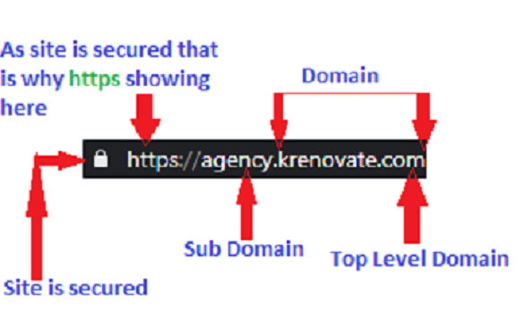

# **Domain**
## **Domain Name**
A domain name is the website name. It is the address where internet users can access the website and also find and identify computers on the Internet. Computers use IP addresses, which are a series of number. However, it is difficult for humans to remember strings of numbers. Because of this, these were developed and used to identify entities on the Internet rather than using IP addresses.

It can be any combination of letters and numbers, and can be used in combination of various domain name extensions, such as .com, .net and more.

It must be registered before one can use it. No two websites can have the same domain name as it is unique. For example if someone types in krenovate.com, it will go to Krenovate's website and no one else's.

## **URL**
A URL (*“Uniform Resource Locator”*) is a complete web address used to reach a particular web destination.
A URL has four major parts:

>**1. HTTPS / HTTP**

<!-- -->
>**2. TLD** 

<!-- -->
>**3. Domain** 

<!-- -->
>**4. Sub Domain**

### **1. HTTPS/HTTP** 

One can capture email IDs using simple sign up forms for newsletter of the company for all the people visiting their website. People who will be interested in the products or services will sign up, as they might be interested to get regular updates about the business. 

The internet has over 1.5 billion websites, the information and data on each website is fetched and presented to us by the **HTTP** (*Hyper transfer text protocol*) technology that is as old as the internet. The **HTTPS** (*Hyper transfer text protocol secure*) is a more secure way of fetching & presenting data and information on websites. 

The data and information on HTTPS websites is encrypted using *SSL certificates*. These certificates convert any data or information in an encrypted format, so that even if someone gets access to some confidential information data from the website it is an encrypted format and no one can perform any scam or fraud online by using such information. To give a simple example, when we buy anything online by entering our credit card details, e-commerce websites use SSL certificates to convert the data we have entered into an encrypted format, so that no one can use our credit card details for any scammy online purchases.

Let’s say our credit card number is 
**1234 5678 9999 0000**,
all HTTPS websites will convert this data into an encrypted format like 

**‘kjbdy87343hkdh873837864hdwsdtrsdwte72328627362876826**
**vsjhdwud67e228736287632’** 

And this encryption changes every time we enter any data on any HTTPS website.

#### **HTTP vs HTTPS**

**HTTP** (*No encryption*)

    Data entered: 1234 5678 9999 0000   
    Data saved as: 1234 5678 9999 0000

  

**HTTPS** (*Encryption through SSL certificates*)

    Data entered: 1234 5678 9999 0000    
    Data saved as: nhnkqoayhgqlabgjmcieioegebsksbshs8782n9dybsjsi8eyey920jsn

   

Needless to say that we should avoid sharing any confidential data on a HTTP website. Also use Google Chrome to safeguard and make people aware about the websites which are not secure.Websites using SSL certificate are marked as safe by Google Chrome.

### **2. TLD**

Also known as the **top-level domain**. The most common used TLD is ‘.com’. TLDs are generally used as a reference to a geographic area or a type of community, group, organisation. For example, *‘.com.au’* will reflect that the website is run by an Australian organisation, similarly
*‘.edu’* is a TLD generally used by colleges, schools and educational institutes. There are more than 1,000 TLDs available in the world. 

#### **Top 10 used TLDs in the world:**

1) .COM: 82.01 million
2) .DE (Germany): 13.05 million
3) .CN (China): 12.55 million
4) .NET: 12.42 million 5) .UK (United Kingdom): 7.83 million
6) .ORG: 7.79 million
7) .INFO: 5.24 million
8) .NL (Netherlands): 3.5 million
9) .EU (European Union): 2.98 million
10) .RU (Russia): 2.31 million

So if we are launching a website for a business in Europe it makes more sense to launch it under the *.EU TLD*, because people in europe would be more accustomed to open websites with *.EU TLD*.
Also there are some TLDs available which directly represent a business category, like the
*.AGENCY TLD*, so if we are planning to open up an agency for any industry, it makes more sense to buy a domain name under the *.AGENCY TLD*.

>**[TLD's used in world](http://data.iana.org/TLD/tlds-alpha-by-domain.txt)**

<!-- -->
>**[Top 10 used TLDs in the world](link)**

### **3. Domain**

Kickstarting any business online with a website starts with booking a domain name. Once we have shortlisted the right TLDs based on our business/organisation category the next step is to search and book the domain name. We should follow the guidelines given below to book a domain name.

1. Shortlist relevant TLDs
2. Prefer a single word for our domain name
3. For example the official name of our organisation is ‘**Krenovate Solutions Pvt Ltd**’ but the website runs under the brand name ‘*Krenovate.com*’
4. ‘Godaddy’ does not have all TLDs available, book domains on 
[United Domains](https://www.uniteddomains.com/)
5. We can book domain name for extra TLDs (like .co, .co.in, .xyz, .work etc.), which are not very expensive, this will be helpful for bulk email marketing.

### **4. Sub Domains**

Apple has a very beautiful website, that anyone can visit by typing in the given 
[Apple link](https://www.apple.com/)
for buying and finding information for all Apple products. On the other hand, customers of Apple, if they want any help or support for their old purchases have to visit [Apple customer support link](https://support.apple.com/).
Both websites (https://www.apple.com/) which is referred to as [Apple link](https://www.apple.com/) here and(https://support.apple.com/)which is referred to as [Apple customer support link](https://support.apple.com/) in this section run on the same domain name i.e. apple.com. These are actually two different websites for different set of users. Visitors of Apple.com and support.apple.com are absolutely different.Prospect or any person who wants to find out any information about Apple visits the main website [Apple link](https://www.apple.com/), while registered customers of Apple visit  [Apple customer support link](https://support.apple.com/) which is a subdomain of Apple.com for help and support on products and services.

Any person/organisation who has bought a domain name can create an unlimited number of subdomains without any extra cost. Subdomains help organisations to manage a similar set of users access relevant information on a separate independent website.

#### **Advantages of sub domain**

1. Specific website for specific stakeholders.
2. Easy to regulate and manage content and information for a specific set of users.
3. Performance of one website does not affect the other, so if one of the subdomain crashes, the others won’t get affected (if all our hosted on separate servers).
4. Designing and planning a website becomes more easy and sensible.
5. All subdomains can eventually run as individual entities.
6. Good for organisations which deal with seperate kind of stakeholders.

Please remember, creating subdomains for different products or services is not beneficial as subdomains are only helpful if we have multiple stakeholders. To be more clear, create subdomains only if you have different stakeholders like customers, vendors, suppliers, employees and prospective customers and that too if it cannot be handled on a single website.