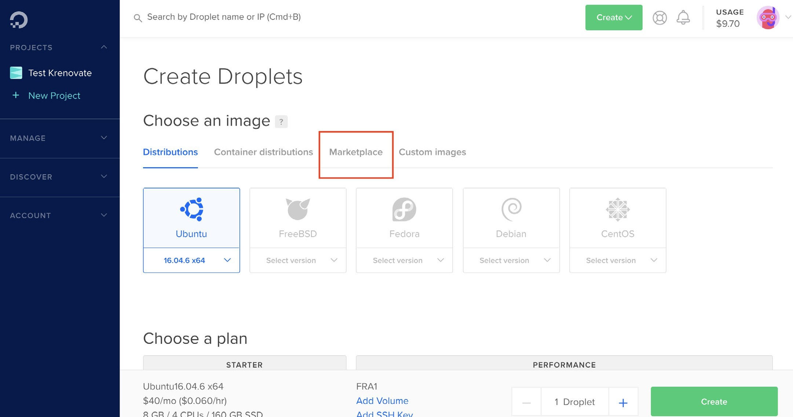
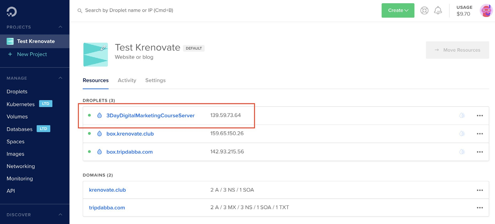
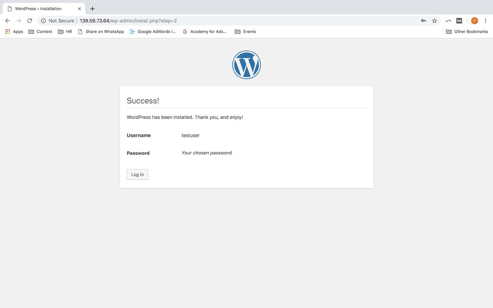

# **Hosting**

## **What is Web Hosting?**

Web hosting is an online service that enables you to publish your website on the Internet. In a nutshell, web hosting is the process of renting or buying space to house a website on the World Wide Web. Website content such as HTML, CSS, and images has to be housed on a server to be viewable online. Hosting is provided by the web hosting service providers.

##  **Web Hosting Service**

A web hosting service is a type of Internet hosting service that allows individuals and organizations to make their website accessible via the World Wide Web. In order to create an online presence, reliable web hosting service is essential. Choosing the right hosting plan will mean having access to the right allocation of resources to keep your website loading quickly and reliably for your visitors. 

### **How to choose the right web hosting service**

There are several web hosting options available. To know which one would be right for your business, ask yourself the following questions:

1.  What kind of website do you plan to host online- a blog, an ecommerce portal, a news website, etc as this will determine how much web traffic you expect and how robust the infrastructure required to host your website, should be.
2.  What are the goals of your website? 
3.  How fast do you see yourself expanding online business?
4.  How much hand-holding do you need?

**Your answers will determine how much you need of the following:**

-   Storage space
-   Bandwidth
-   Control–is it important that you have root control of your server?
-   Cost–how much are you either willing to spend or need to spend?

### **Web Hosting service providers**

A web hosting service provider or web host, is a business that provides the technologies and services needed for the website or webpage to be viewed in the Internet. Most hosting companies require that you own your domain in order to host with them. If you do not have a domain, the hosting companies will help you purchase one. Some of the best web hosting service providers are:

1.  Hostinger
2.  Bluehost
3.  GoDaddy
4.  HostGator
5.  DreamHost

Below are some of the features you can expect from your hosting provider:

### **How to choose the best web hosting service provider**

In order to choose the best web hosting service provider, investigate their performance or claims in the following area:

1.  Uptime-Do they guarantee at least a 99% uptime? Where are their servers located?
2.  Years in the industry-One way to determine their credibility
3.  Customers-How many customers do they serve? In what locations do they have a presence?
4.  Online reviews and testimonials-These should give you a more factual idea of the company’s reputation
5.  Support-Does the company offer 24X7 support with trained personnel to assist you?
6.  Related products-Select a web hosting company that offers you other related web service products such as security, email and backup services. Getting it all in one place could reduce the time coordinating with different providers
7.  Security considerations
8.  Backup services
9.  Mobile Access– Can you access your control panel from a device on the go?

##  **How Web Hosting works**

When you sign up for a web hosting service, you basically rent some space on a physical **server** where you can store all the files and data necessary for your website to work properly. 

### **Servers**

A server is a physical computer that runs without any interruption so that your website is available all the time for anyone who wants to see it. Your web host is responsible for keeping that server up and running, protecting it from malicious attacks, and transferring your content — such as text, images, files, etc. — from the server to your visitors’ browsers.

A server is a computer that connects other web users to your site from anywhere in the world. As the name implies, web hosting service providers have the servers, connectivity, and associated services to host websites. By offering a variety of hosting plans, they cover the spectrum of hosting needs, from small blogs and large organizations.

Simply put, all machines that store data and serve it on request are servers. For eg: laptop, USB, phones etc.

####    **Types of Servers**

Servers can be online and offline. 

**Offline servers** are your laptop, USB, mobile phones and anything that shows you data **without using the internet**. 

**Online servers** are similar machines which store information and data and are **only accessible through the internet**.

Online servers are provided by hosting providers, companies which are in the business of creating and managing online servers. For example, Godaddy is a hosting provider that offers a range of different types of online servers that you can use to store and run your websites and apps. All online servers have an IP address, which is used to access the information on that server.

##  **Types of Hosting**

Most web hosts offer different types of hosting so that they can serve the needs of different clients — whether you want to build a simple personal blog or own a large online business and are in a dire need of an intricate company website. Here are the most popular options available:

-   Shared hosting
-   VPS hosting
-   Cloud hosting
-   WordPress hosting
-   Dedicated hosting

For the sake of understanding, we will discuss the two most important options, namely, Shared Hosting and Cloud Hosting.

### **Shared Hosting**

With this type of hosting, your site shares a physical server with one or more other websites. Shared hosting allows multiple websites to utilize a single server. Usually, you’ll have no idea who or what websites you’re sharing the resources of a server with.

### **Cloud Hosting**

Cloud hosting is a type of web hosting which uses multiple different servers to balance the load and maximize uptime. Instead of using a single server, your website can tap into a “cluster” that uses resources from a centralized pool. Visualise the cloud as a web of different computers which are all interconnected. As more machines are hooked up to the network, more resources are added to the overall cloud.

### **Difference between Shared Hosting and Cloud Hosting**

In this section we will discuss the main difference between Shared and Cloud Hosting:

| **Shared Hosting** | **Cloud Hosting**|
| :-------------- | :-------------|
| **1.** Multiple websites are hosted on a single server.| **1.** Dedicated individual server for each website. |
| **2.** All websites have a common IP address. | **2.** Each website has an exclusive IP address. |
| **3.** If the server crashes, all websites  go down together. | **3.** If the server crashes, only the website hosted on it crashes, does not affect other websites. |
| **4.** If you buy shared hosting, you  get server space in a server that is also being used for other websites.| **4.** If you buy cloud hosting, you get server  space in a dedicated server that is exclusively being used for only your website. |
| **5.** You cannot make any technical changes to the server as it is shared. | **5.** You can make whatever technical changes you want to perform in your cloud server. |
| **6.**  Good for simple business websites. | **6.** Good for e-commerce and product based websites.
| **7.** Prices are generally affordable and cheap. | **7.** Prices are dynamic based on server usage, they go up with the no. of users on your website. |

>:computer: [Web Hosting Tutorial](https://www.hostinger.com/tutorials/what-is-web-hosting/)

>:computer: [More about Web Hosting](https://www.website.com/beginnerguide/webhosting/6/1/what-is-web-hosting?.ws)

## **Setting Up Cloud Hosting for Wordpress Websites**

Since we will be training you for website design & development ahead in the course on wordpress websites, we will teach you how you can quickly setup hosting for your wordpress website.

Guidelines to select a cloud hosting provider for beginners:

-   Choose a provider where setting up a server is easy.
-   Options like one-click installs are available.
-   Pricing has definite plans with fixed pricing per month.
-   Has good community support and resources to read and learn.

[Digital Ocean](https://www.digitalocean.com/) is a platform which has all the aforementioned guidelines for choosing a cloud hosting provider. We will also be using Digital Ocean to teach you how to setup cloud hosting for your wordpress website.

**Step 1:** Make an account on Digital Ocean <https://www.digitalocean.com/>

1.  Visit [Digital Ocean](https://www.digitalocean.com/)
2.  Use the sign up form as shown in the image below to make an account.

    

**Step 2:** Create a Droplet (Cloud Hosted Server) with One-click Wordpress Installation  

1.  Log in and click the ‘CREATE’ button and choose ‘DROPLETS’ in the dropdown as shown
in the image below.

    

2.  Click on ‘Marketplace’ which has all the options for one-click installations as shown in the image below. We here at Krenovate work on **Openlitespeed Wordpress**.

    

3.  Choose the option of ‘WORDPRESS’ from the list in the marketplace, it will be at the end
of the list as shown in the image below.

    

4.  Choose a ‘STANDARD’ plan it’s good enough for any wordpress business website, and select the pricing plan from the available plans, I would suggest you to go get started with
$5 plan, as shown in the image below and you can always upgrade as per your needs.

    

5.  Leave the Backup and Block Storage sections as default, as shown in the image below.

    

6.  Choose a ‘DATACENTER’, this step is important. You should always choose a datacenter which is geographically nearest to your prospective customers. For example, if you are building a website for users who stay in India, you should select ‘Bangalore’ as a datacenter. Having a datacenter in the same country helps to serve data more quickly to the people visiting the website, making your website experience better for your website visitors.

    

     

7.  Name Your Droplet, and Finally Click on ‘CREATE’ as shown in the image below

    

8.  Droplet creation loader is visible on your dashboard and only takes a few seconds to be created as shown in the image below

    

9.  IP address and a success email on the registered email ID are two things you should see and receive on the successful creation of your droplet with wordpress installed on it, as shown in the images below

    

    

**Step 3:** Change the Password For Your Droplet Server

This is a very important step, to secure your cloud server and also a compulsory step after successful droplet creation. Follow the following sub-steps to successfully change password of your server.

1.  Access your droplet console, click on the 3 dots in front of your droplet name and click on console from the dropdown as shown in the image below:

    

2.  Enter your username (root) on the console screen, you would have received a username
and password in your registered email id, as shown in the image below:

    

3.  Enter your password, and the system will automatically tell you to create a new password and confirm the same as shown in the image below. Please note that whatever you type in the password field is not visible for security reasons. So please type carefully and do not forget the new password you create on this step.

    

4.  Exit the console after you see that you have successfully logged into your server. The screen will display a message like shown in the image below:

    

**Step 4:** Complete the wordpress installation on your droplet (Server) by following the steps below

1.  Choose Wordpress Language. Open the IP address of your new droplet in Google Chrome or any other browser and select the language in which you would like to manage your wordpress website as shown in the image below

    

2.  Enter basic details and click on ‘Install’ to complete Wordpress installation on your droplet, as shown in the image below

    

3.  Wordpress successfully installed screen should be visible to you, as shown in the image below

    

4.  Open your new wordpress website by visiting the IP address in a browser, your new fresh
wordpress website should look like as shown below:

    

