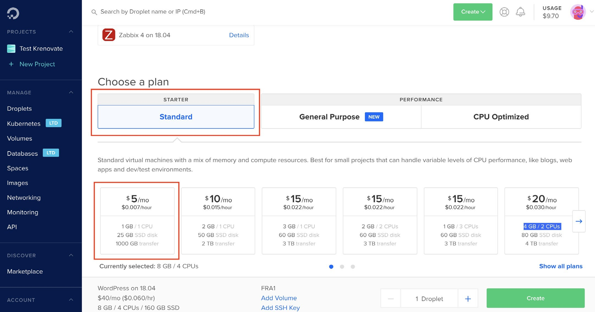
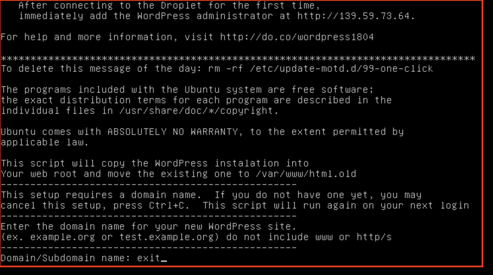

# **Hosting**
## **Introduction**

Web hosting is an online service that enables you to publish your website on the Internet. When you sign up for a web hosting service, you basically rent some space on a server where you can store all the files and data necessary for your website which can be accessed anytime through the internet to work properly.Hosting is done by the web hosts.

Web hosts are companies that rent out their services and technologies to host websites on the internet. Once the hosting company hosts your website, users can access it by typing in your web address (domain name) in their web browser. When they do this, their computer connects to the server your website is hosted on.

## **Servers**

Servers are machines that store and serve data on request. USB is a server, as it stores your data and when you attach it to a USB port it shows you the files and data in it. Similarly all machines that store data and serve it on request are servers.

Servers can be online and offline. Offline servers are your laptop, USB, mobile phones and anything that shows you data without using the internet. Online servers are similar machines which store information and data and are only accessible through the internet.

Online servers are provided by hosting providers, companies which are in the business of creating and managing online servers. For example, Godaddy is a hosting provider that offers a range of different types of online servers that you can use to store and run your websites and apps. All online servers have an IP address, which is used to access the information on that server.

## **Difference between Shared amd Cloud hosting**

| **Shared Hosting** | **Cloud Hosting**|
| :-------------- | :-------------|
| **1.** Multiple websites are hosted on a single server.| **1.** Dedicated individual server for each website. |
| **2.** All websites have a common IP address. | **2.** Each website has an exclusive IP address. |
| **3.** If the server crashes, all websites  go down together. | **3.** If the server crashes, only the website hosted on it crashes, does not affect other websites. |
| **4.** If you buy shared hosting, you  get server space in a server that is also being used for other websites.| **4.** If you buy cloud hosting, you get server  space in a dedicated server that is exclusively being used for only your website. |
| **5.** You cannot make any technical changes to the server as it is shared. | **5.** You can make whatever technical changes you want to perform in your cloud server. |
| **6.**  Good for simple business websites. | **6.** Good for e-commerce and product based websites.
| **7.** Prices are generally affordable and cheap. | **7.** Prices are dynamic based on server usage, they go up with the no. of users on your website. |

## **Setting Up Cloud Hosting for Wordpress Websites**
Since we will be training you for website design & development ahead in the course on wordpress websites, we will teach you how you can quickly setup hosting for your wordpress website.

Guidelines to select a cloud hosting provider for beginners:

- Choose a provider where setting up a server is easy.

-  Options like one-click installs are available.

- Pricing has definite plans with fixed pricing per month.

-  Has good community support and resources to read and learn.

[Digital Ocean](https://www.digitalocean.com/) is a platform which has all the aforementioned guidelines for choosing a cloud hosting provider. We will also be using Digital Ocean to teach you how to setup cloud hosting for your wordpress website.

>### **Step 1:** Make an account on Digital Ocean <https://www.digitalocean.com/>

-  Visit [Digital Ocean](https://www.digitalocean.com/)
-  Use the sign up form as shown in the image below to make an account.

>### **Step 2:** Create a Droplet (Cloud Hosted Server) with One-click Wordpress Installation  

-  Log in and click the ‘CREATE’ button and choose ‘DROPLETS’ in the dropdown as shown
in the image below.

-  Click on ‘Marketplace’ which has all the options for one-click installations as shown in the image below. We here at Krenovate work on **Openlitespeed Wordpress**.

-  Choose the option of ‘WORDPRESS’ from the list in the marketplace, it will be at the end
of the list as shown in the image below.

-  Choose a ‘STANDARD’ plan it’s good enough for any wordpress business website, and select the pricing plan from the available plans, I would suggest you to go get started with
$5 plan, as shown in the image below and you can always upgrade as per your needs.

-  Leave the Backup and Block Storage sections as default, as shown in the image below.

-  Choose a ‘DATACENTER’, this step is important. You should always choose a datacenter which is geographically nearest to your prospective customers. For example, if you are building a website for users who stay in India, you should select ‘Bangalore’ as a datacenter. Having a datacenter in the same country helps to serve data more quickly to the people visiting the website, making your website experience better for your website visitors.

-  Name Your Droplet, and Finally Click on ‘CREATE’ as shown in the image below

-  Droplet creation loader is visible on your dashboard and only takes a few seconds to be created as shown in the image below

-  IP address and a success email on the registered email ID are two things you should see and receive on the successful creation of your droplet with wordpress installed on it, as shown in the images below

>### **Step 3:** Change the Password For Your Droplet Server

This is a very important step, to secure your cloud server and also a compulsory step after successful droplet creation. Follow the following sub-steps to successfully change password of your server.
-  Access your droplet console, click on the 3 dots in front of your droplet name and click on console from the dropdown as shown in the image below:

-  Enter your username (root) on the console screen, you would have received a username
and password in your registered email id, as shown in the image below:

-  Enter your password, and the system will automatically tell you to create a new password and confirm the same as shown in the image below. Please note that whatever you type in the password field is not visible for security reasons. So please type carefully and do not forget the new password you create on this step.

-  Exit the console after you see that you have successfully logged into your server. The screen will display a message like shown in the image below:

>### **Step 4:** Complete the wordpress installation on your droplet (Server) by following the steps below

-  Choose Wordpress Language. Open the IP address of your new droplet in Google Chrome or any other browser and select the language in which you would like to manage your wordpress website as shown in the image below

-  Enter basic details and click on ‘Install’ to complete Wordpress installation on your droplet, as shown in the image below

-  Wordpress successfully installed screen should be visible to you, as shown in the image below

-  Open your new wordpress website by visiting the IP address in a browser, your new fresh
wordpress website should look like as shown below:

