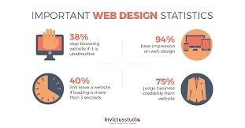
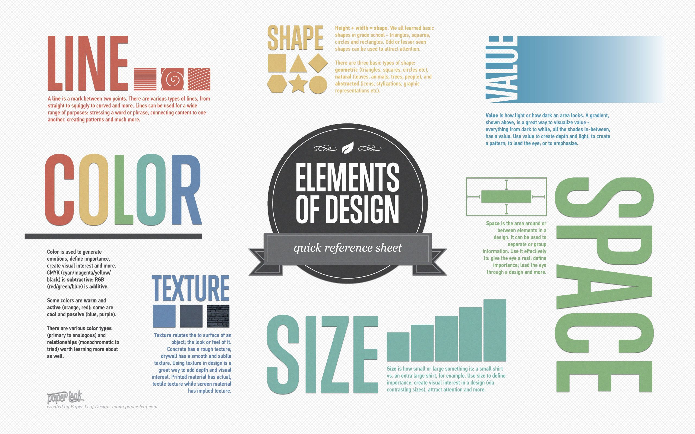
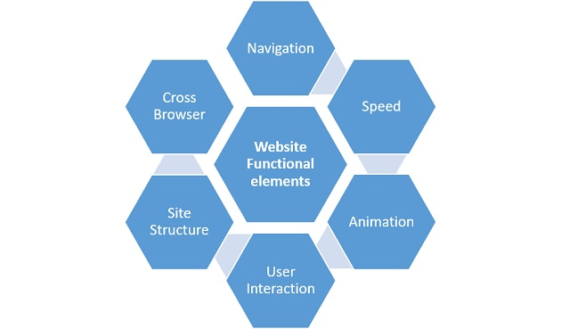
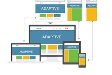
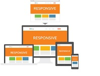

# **Website Designing**

**_"Design is not just what it looks like and feels like. Design is how it works."_** -Steve Jobs

## **What is Web Designing**

A web design can have various definitions:

-   Web design is the process of planning, conceptualizing, and arranging content intended for the Internet.
-   It refers to the design of websites that are displayed on the internet. It usually refers to the user experience aspects of website development rather than software development.
- Web design is what creates the overall look and feel when you’re using a website. It’s the process of planning and building the elements of your website, from structure and layout to images, colors, fonts and graphics.

Modern web design goes beyond how things **look (aesthetics)** to include how things **work (functionality)**. Web design is not limited to websites as it includes other uses such as web apps, mobile apps, and user interface design.

##  **Why is Web Design Important**

**_If only given 15 minutes to consume content, 66 percent of people would prefer to see something beautifully designed versus something plain and simple._**

There is no arguement about the fact that **First impressions really matter.** Your website’s design is an important part of your online marketing presence. To build a better website for your business, you must understand the importance of web design. So, let's look at the reasons why Web Design is important:

1.  **It sets the first impression** : The first impression impacts how your audience will perceive your brand. A good design will help keep leads glued to your page.
2.  **It aids the SEO strategy** : Many web design elements and practices influence how you publish content on your website, which in turn affects how search engine spiders crawl and index your website. This is one thing you cannot afford to mess up.
3.  **It sets the impression for customer service** : Think of your web design as the digital face of your business. If someone walked into your physical location, wouldn’t you want a friendly face to greet them and make them feel welcome? An updated and modern web design is the equivalent to a friendly face greeting your new visitors. Your design gives them insight as to how you view your audience and the efforts you are ready to put in to make them satisfied.
4.  **It builds trust with your audience** : It’s important to build trust with your audience so they remain on your site. When visitors remain on your site longer, you create more opportunities for your business to capture those leads. A professional site signals trust with your audience. 
5.  **Your competitors are doing it** : A well-designed website is an opportunity for your business to showcase your unique features. You can show your audience why they should choose your business over the competition.
6.  **It creates consistency** : Consistency helps your audience build brand recognition and keeps them engaged on your page for longer. You need to have the same fonts, styles, and layouts across every page on your website otherwise your site will look unprofessional. 

    

   
##  **Features of a effective Web Design**

A good/effective web design is easy to use, aesthetically pleasing, and suits the user group and brand of the website. In order to acheive a quality design, we have to keep in mind the most important elements of web design. 

When designing a website, it’s imperative to consider both the **look (Visual Elements)** and the **functionality (Functional Elements)** of the site. Integrating these elements into the design will help maximize the performance of the site, regardless of how performance is measured. Let's look at what these elements are:

### **Visual Elements**

Here’s a quick overview of the elements you need to consider in your design to make sure everything looks good!

-   **Written Copy** : Fundamentally, the look of a website and its words go hand in hand. The two should never really be considered separate. Having your designers and content writers work together, can be a more powerful combination.
-   **Fonts** : It's imperative to easy-to-read font pairings that complement the design.
-   **Colors** : Colors are one of the most important elements to consider when designing a website. When choosing colors for your site, it’s important to focus on aligning your colors with your brand and the message you are trying to convey.
-   **Layout** : How you decide to arrange your content will have a dramatic impact on both the appearance and functionality of your site.
-   **Shapes** : Graphical elements have taken an important place in web design. Combining beautiful colors and shapes can be used to accomplish many things, such as directing the attention of your site visitors.
-   **Spacing** : There is a space that exists between every element within your design: the images, the paragraphs, the lines... even the letters have spacing! As a rule of thumb, having too much space is better than having things crammed together.
-   **Images & Icons** : Amazing designs can communicate a lot of information in just a few seconds. One of the ways to accomplish this is through the use of powerful images and icons.
-   **Videos** : When used properly, they can help your website visitors experience something that simply can’t be described with words or images. One thing to keep in mind is that eye-catching videos can be distracting and should never compete with your content.

### **Funtional Elements**

The functional elements decide the working of any website. Let's look at the elements involved:

-   **Navigation** : Navigation is one of the main components that determines if your website actually “works”. The navigation should serve multiple purposes, like, catering to the needs of a new user and a returning user.

    There are a few [best practices](https://www.orbitmedia.com/blog/website-navigation/) you will want to follow.

-   **Speed** : No one likes slow websites. Regardless of how nice your design is, if it doesn’t load within a reasonable time, it will not perform in search, and it will not accomplish your goals. Choose tools which provide optimum performance.
-   **Animations** : Effective web animation techniques can help your design accomplish a wide range of tasks, from grabbing a user’s attention to giving feedback on certain interactions with content like buttons or forms. 
-   **User Interactions** : The best designs should always simply the visitor interactions (scrolling, clicking, typing) giving the user the impression that they are in complete control.
-   **Site Structure** : A website’s structure plays an important role in both user experience and SEO. If people are getting lost navigating through your site, chances are, crawlers will too. 

    [Some tips to create effective site structure are available here](https://neilpatel.com/blog/site-structure-enhance-seo/)

-   **Cross-browser & cross-device compatibility** : A great design is the one that will look good on all devices and browsers (including Internet Explorer).

##  **Types of website design**

Although you might come across articles online that talk about a whole bunch of website design styles (fixed, static, fluid, etc), but there are only two ways to properly design a website: adaptive and responsive websites.

### **Adaptive Websites**

Adaptive web design uses two or more versions of a website that are customized for different screen sizes. Adaptive websites can be split in two main categories based upon how the site detects what “version” needs to be displayed. 

Basically, this means the site knows what version to display (ex: desktop or mobile).

### **Responsive Websites**

Responsive websites use a combination of flexible grids (based on percentages) with breakpoints (using media queries) to create a custom look at every screen size. Unlike adaptive sites that adapt only when they hit a breakpoint, responsive websites are constantly changing according to the screen size.

##  **Designing Process**

The designing process of a great website consists of two parts:

-   [UX](UX.md) - User Experience
-   [UI](UI.md) - User Interface

##  **Help & Guides**

-   [Web Design Guide](https://www.pagecloud.com/blog/web-design-guide)
-   [Guide for importance of Web Design](https://www.webfx.com/web-design/why-is-web-design-important.html)

   

