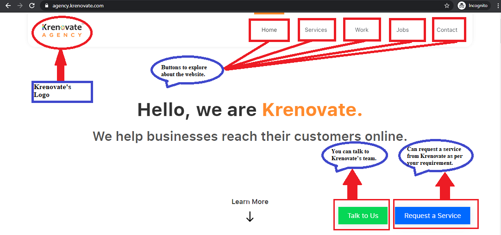
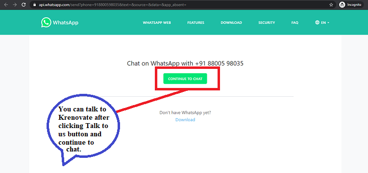
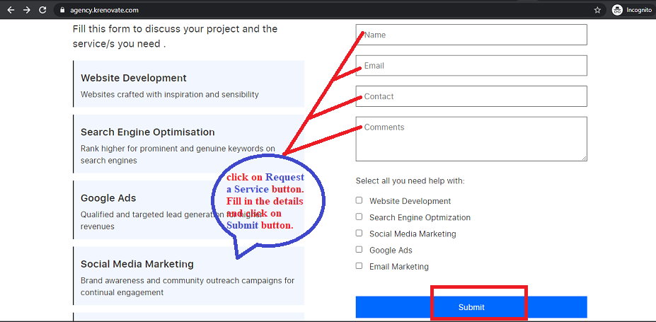

## **UI**

### **What is UI Design**?

- It is the  process designers use to build interfaces in software/computerized devices, focusing on looks/style. 

- User interface (UI) is the space where interactions between humans and machines occur. These are the access points where users interact with designs. It has three formats:

  - Graphical user interfaces (GUIs)

  - Voice-controlled interfaces (VUIs)

  - Gesture-based interfaces

### **UI Designer Roles and Responsibilities**

- It is the UI designer’s job to bring the UX designer’s vision to life. 

- A UI designer is responsible for creating interactive programs that enhance a customer's experience with a brand and facilitate an enjoyable experience on the website. 

- They are also responsible for ensuring consistency, so creating a style guide, or visual language to be used across the board.

- Generally they follow the following steps:

  - **Collaboration :**

     - At the start of the process, the UI designer needs to work closely with both UX designer and client/users.
     
     - They can clearly know about the requirements of the user/client.

     - As user research and  personas are the responsibility of a UX designer but it is the UI designer's job to take this information and run with it as a UX designer will most likely provide you with a wireframe.

     - Now you can hand the design over to the developers as building a rapport and better communication are crucial for the success of your project.
     
  - **Design :**

    - It includes designing screens and creating visual touch points, as well as the interactivity behind them. 
   
    - While designing they will consider the following points:

      - How much space should be left between each element? 

      - How the app will display on various screen sizes?

      - Designing UI elements such as buttons, icons,    sliders and scrollbars

      - Color theory to create an awesome, unique color palette that injects some personality into the website or app. 
      
      - Choosing the correct fonts and typesetting.

      - What does a button do when the user clicks on it?

      - Creating animations.

      - Establishing a style guide to be used throughout the application, ensuring consistency and familiarity for the user.

  - Prototyping
      
      - It enables you to showcase your visual designs in action, helping you to quickly identify flaws and smooth over any rough edges.

      - Prototyping and testing is a crucial part of the UI design workflow, as it will allow you to ensure that the final product ticks all the boxes.

      - There are three different types of prototypes: 
        
        - Low fidelity wireframes
        - Clickable prototypes
        - High fidelity prototypes

### **How UI Design looks like**

## **Difference between UX and UI**

To be addded
## **How do UX and UI design work together**

To be added

https://careerfoundry.com/en/blog/ui-design/what-does-a-ui-designer-actually-do/
