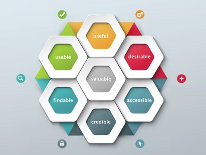
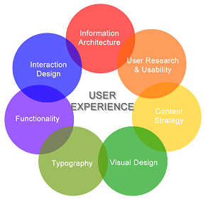
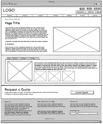
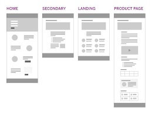
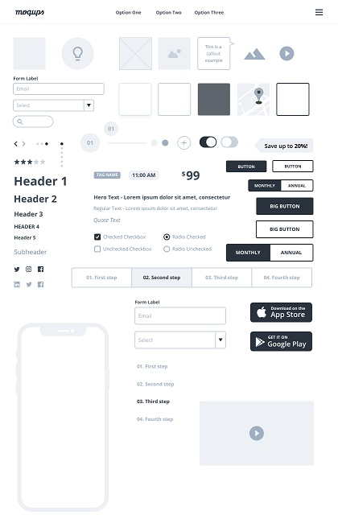

# **User Experience (UX)**

**_“User experience encompasses all aspects of the end-user’s interaction with the company, its services, and its products.”_** ~ Don Norman ~

## **What is UX Design?**

UX Design is the process of designing products that are useful, easy to use, and delightful to interact with. It is about enhancing the experience that people have while interacting with your product, and making sure they find value in what you are providing.

Some industry experts have their own definitions of UX discussed as below:

1.  It is the process used to determine what the experience will be like when a user interacts with your product.
2.  It is an approach to design that takes the user into account.
3.  It is about solving problems through empathy.
4.  It is a process for designing systems that offer a great experience to users.
5.  It is improving how useful, easy, pleasant, marketable, or addictive it is to use a product.
6.  It is the fulfillment of a brand’s promise.
7.  It is the art and science of generating positive emotions through product interactions.
8.  It is a commitment to building products with the customer in mind.
9.  It is the creative and analytical process of determining what a website, device, or piece of software is going to be.
10. It is so much more than just designing for a screen.
11. It is design with an awareness of every touchpoint that makes up the overall experience with your product or service.
12. It is a process of deeply understanding the user's needs and objectives.
13. It is a commitment to developing products and services with purpose, compassion, and integrity.
14. It’s the practice of meeting people’s needs before, during, and after product development.
15. It is about delighting users by anticipating their needs and giving them something they didn’t think to ask for.  

In all the above definitions, we can see that a UX Design is completely user-centric. It's all about delighting the user.

**There are seven factors that influence the user experience:**

**The key ingredients for a great user experience on a website include the following:**

>:computer: [More on What is UX Design](https://www.interaction-design.org/literature/topics/ux-design)

>:computer: [UX Design Tutorial](https://careerfoundry.com/en/blog/ux-design/what-is-user-experience-ux-design-everything-you-need-to-know-to-get-started/)

## **The Design Process**

The design process involves:

- researching and studying [user behaviour](../Content-Mapping/Building-User-Personas.md)
- understanding the [content map](../Content-Mapping/Strategic-content-map.md) created for the different [user lifcycle stages](../Content-Mapping/Building-User-Lifecycle.md).

The output of this stage is a **wireframe**, which depicts the exact places and points for everything that needs to be presented on the website.

### **Wireframe**

A wireframe is a simple black and white blueprint/layout that focuses purely on a site's structural elements.

They are devoid of color, font choices, logos or any real design elements that take away from purely focusing on a site’s structure.

A wireframe is commonly used to lay out content and functionality on a page which takes into account user needs and user journeys. 

A wireframe is:

* A grayscale blueprint of your site’s key conversion pages
* A view into how your site, and each page, might tell your story
* A chance to explore features, elements, calls-to-action, and site navigation
* A first glance at header copy, scannable sections, and more in-depth sections
* A chance to understand how each page lends itself towards conversion as part of a complete UX
* An opportunity to make changes to structure, architecture, and identify what’s missing

Here are a few examples of how a wireframe looks like:

>:computer: [Read more about Wireframing](https://www.experienceux.co.uk/faqs/what-is-wireframing/)

####  **Advantages of Wireframing**

The most important advantges of going through the process of Wireframing are as below:

- It provides an early visual that can be used to review with the client. 
- Users can also review it as an early feedback mechanism for prototype usability tests. 
- As wireframes are easier to amend compared to concept designs, once they are approved by the client/users, they provide confidence to the designer to move ahead with the design.
- A wireframe provides confidence to the clients as they get know how their final product may look like.

From a practical perspective, the wireframes ensure the page content and functionality are positioned correctly based on user and business needs. And as the project moves forward they can be used as a good dialogue between members of the project team to agree on the project vision and scope.

>:computer: [Reasons for Wireframing](https://www.orbitmedia.com/blog/7-reasons-to-wireframe/
)

####  **Types of Wireframes**

Typically, at Krenovate we use two types of wireframes. Let's have a look of these:

##### **Low-fidelity Wireframes**

Low-fidelity wireframes are basic visual representations of the webpage and usually serve as the design’s starting point. They are typically concept sketches, a set of drawings or storyboard, representing the skeleton of the interface. 

Low fidelity wireframes include the most basic content and visuals and are usually static (not interactive). They are often used to help map out the shell of the interface, its screens and basic information architecture.

Below is an image of a simple low-fidelity wireframe:

##### **High-fidelity Wireframes**

High fidelity wireframes or prototypes are more complete representations of the end product. Many are clickable and respond to the user’s actions, mimicking authentic interface interaction.

Their aesthetics and content are more precise than lower down the fidelity spectrum, as designers concentrate on refining the graphics, spacing and layout.

These wireframes provide test participants with realistic representations of what the product will look and feel like, as well as how it will respond to them.

A typical high-fidelity wireframe looks like:

####  **Wireframe Tools**

The process of wireframing/prototyping is made easy by using the below tools:

- Adobe Xd
- Figma
- Sketch

##  **Some UX facts to be remembered:**

- UX planning should be done thoroughly and should be aligned with the content maps created for the website. Do not skip this step. 
- Business owners/clients should be closely involved in finalising and reviewing these wireframes as this reduces a lot of iteration work on the further stages of UI and development.
- The more time and effort you put on this stage, the more quickly the final website can be delivered.
- Sometimes UX planning is left to the graphic designer, that is a blunder you can do for your website. **Graphic designers are not UX experts**. **UX experts** are people who study online user
behavior based on content maps and industry research to create working prototypes. 

  

 

